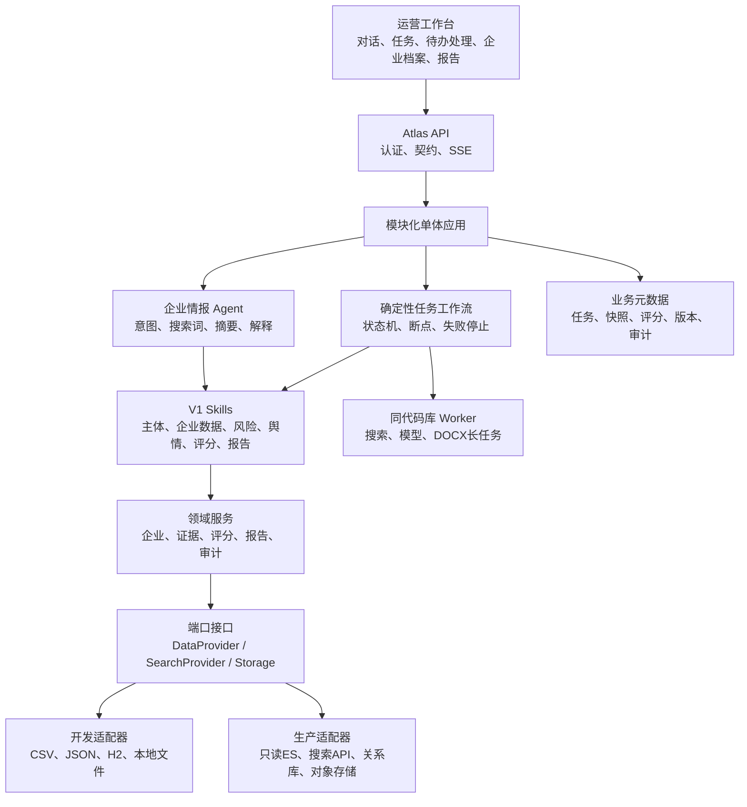
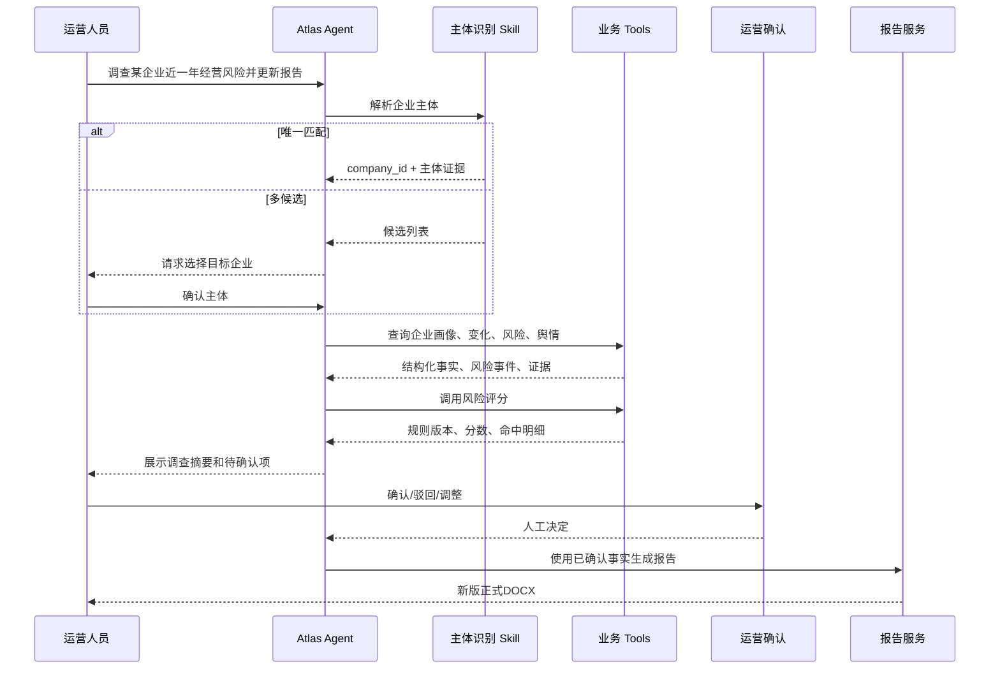
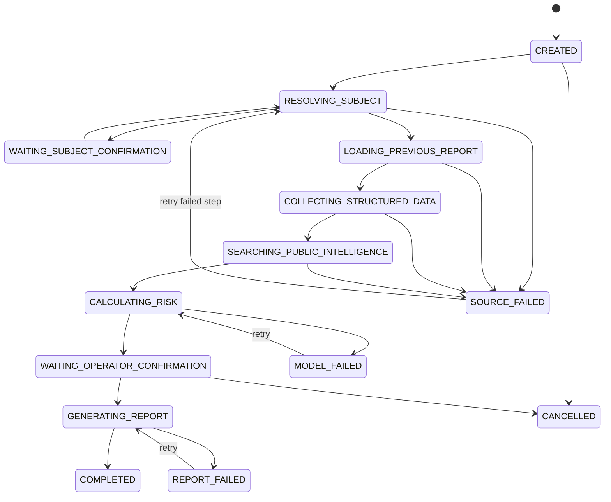
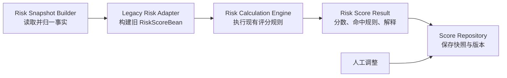

# Atlas 企业情报 Agent 详细设计 V1.2

> 文档状态：开发基线评审稿  
> 设计日期：2026-07-29  
> 更新日期：2026-07-29  
> 面向对象：产品、企业风险运营、后端研发、算法/大模型、数据工程、测试、运维与安全  
> 建设原则：一个企业情报 Agent + 多个可独立测试、可复用、可审计的 Skills

---

## 0. V1.2 评审决策与冻结范围

V1.2 在 V1.1 总体设计基础上完成开发收口：V1 只实现“单企业旧风险报告更新”，采用模块化单体、一个 Agent 与确定性工作流，开发期使用离线数据和本地存储，ES 仅保留生产适配接口。后文的招商、批量、关系图谱、审批和完整管理平台均为远期能力，不进入 V1 代码、接口、排期和验收。

### 0.1 第一版唯一业务目标

第一版只解决一个生产问题：

> 帮助企业风险运营人员，在旧报告基础上核验企业最新工商、经营风险和负面公开信息，形成一份可追溯、可由当前运营人员确认的新版本风险报告。

企业查询是完成该任务的基础能力，不单独作为第一版价值验收；招商线索、企业比较、批量调查和完整平台管理能力保留在总体架构中，但不进入 V1 验收。

V1 的输入、输出和完成条件如下：

| 类别 | 冻结定义 |
|---|---|
| 输入 | 完整企业名称或统一社会信用代码、旧版正式报告、调查时间范围、运营补充要求 |
| 必须处理 | 主体确认、旧报告解析、最新工商核验、结构化风险查询、公开负面信息检索、证据核验、风险评分、运营确认、报告差异 |
| 输出 | 新版风险报告草稿、结构化风险发现、证据清单、评分快照、人工修改记录、旧/新报告差异 |
| 完成条件 | 主体已确认；所有必查来源查询成功；重大结论有证据；改分有原因；运营人员确认结果并生成新版 DOCX |
| 不在 V1 | 招商推荐、批量企业任务、自动对外发布、全量 ES mapping 迁移、多 Agent 协作 |

### 0.2 V1 产品信息架构

普通运营人员的主导航固定为五个页面：

1. Agent 对话：下达自然语言任务、上传旧报告、查看执行过程；
2. 调查任务：查看任务状态、异常、处理人和完成时限；
3. 待办处理：确认主体与证据、处理风险发现、人工改分、比较报告版本；
4. 企业档案：查看确认后的企业事实、风险事件和历史调查；
5. 报告中心：查看处理中、待运营确认、已生成、废止和版本差异。

Skills、工具、任务策略、数据源、规则、模板、模型、评测、监控、审计和权限统一放入“管理后台”，仅向平台管理员开放。前台与后台共享统一任务、企业、证据和审计数据，不复制业务对象。

### 0.3 已冻结的关键技术决策

| 决策 | V1.1 结论 |
|---|---|
| 企业主键 | 使用平台生成的不可变 `atlas_company_id`（UUID）；统一社会信用代码是强身份锚点但不是内部主键 |
| 旧数据兼容 | 保留旧 MD5、ES 文档 ID、来源系统 ID，全部通过身份绑定表映射到 `atlas_company_id` |
| 任务一致性 | 每个正式调查任务冻结 `snapshot_id`；同一任务的事实、事件、评分和报告只引用该快照 |
| 风险模型 | 不直接在线调用带写入、通知、队列等副作用的 `updateRiskInfo`；先隔离为只读影子计算，再逐步抽取纯规则 |
| 公开检索 | 生产环境优先使用合规、授权的搜索 API 或内容服务；浏览器自动化只用于内部调试和应急，不作为默认生产方案 |
| 数据存储 | PostgreSQL 保存权威业务元数据和版本，ES 保存检索投影，对象存储保存原始证据和报告文件 |
| 正式报告 | 自动生成仅产生待确认结果；风险运营人员确认后生成正式 DOCX，不设置审核或二审 |
| 缺失语义 | 查询失败、来源不可用和返回 0 条必须区分；任一必查来源失败时进入 `SOURCE_FAILED` 并停止 |

### 0.4 稳定企业身份设计

企业身份不得依赖企业名称或单个数据源的文档 ID。推荐模型：

```text
atlas_company
  atlas_company_id UUID PK
  canonical_name
  unified_credit_code nullable
  registration_no nullable
  status
  merged_into_company_id nullable
  created_at / updated_at

company_identity_binding
  binding_id UUID PK
  atlas_company_id FK
  source_system
  source_entity_id
  legacy_md5 nullable
  unified_credit_code nullable
  valid_from / valid_to
  confidence
  binding_status
  UNIQUE(source_system, source_entity_id)

company_alias
  atlas_company_id FK
  alias_name
  alias_type
  valid_from / valid_to
  source_id
```

身份解析顺序：

1. 统一社会信用代码精确匹配；
2. 来源系统 ID 或旧 MD5 精确匹配；
3. 企业名称、登记机关、法定代表人、地址等多字段候选匹配；
4. 多候选或低置信度时必须由运营人员确认；
5. 合并企业只更新 `merged_into_company_id`，不物理删除原身份和历史报告。

### 0.5 V1 物理数据设计

#### 0.5.1 关系数据库核心表

| 表 | 用途 | 关键索引 |
|---|---|---|
| `atlas_company` | 企业主实体 | `unified_credit_code`、`canonical_name` |
| `company_identity_binding` | 多来源身份映射 | 唯一 `(source_system, source_entity_id)`、`legacy_md5` |
| `data_snapshot` | 一次调查的数据冻结点 | `(atlas_company_id, created_at desc)`、`task_id` |
| `investigation_task` | 调查任务及状态机 | `(status, priority, due_at)`、`atlas_company_id` |
| `task_step` | Agent/Skill/Tool 执行记录 | `(task_id, sequence_no)`、`trace_id` |
| `risk_event` | 标准化风险事实 | `(atlas_company_id, event_type, occurred_at desc)`、`dedupe_key` |
| `evidence` | 证据元数据、归属和状态 | `(atlas_company_id, captured_at desc)`、`content_hash` |
| `finding` | Agent 形成的待复核发现 | `(task_id, review_status)`、`risk_type` |
| `operator_decision` | 确认、驳回、改分和原因 | `(task_id, created_at)`、`operator_id` |
| `risk_score_snapshot` | 原始分、人工分和规则版本 | `(task_id, score_version)` |
| `report_version` | 报告文件、状态和版本关系 | `(atlas_company_id, report_type, version_no)` |
| `audit_event` | 不可变业务审计记录 | `(trace_id, occurred_at)`、`actor_id` |

所有可重复执行的写入必须带 `idempotency_key`。风险事件去重键建议由“企业主键 + 风险类型 + 来源 + 来源事件 ID”生成；无来源事件 ID 时使用标准化主体、日期和内容指纹生成，人工合并保留原始记录。

#### 0.5.2 开发与生产存储形态

- 无中间件开发模式使用 H2 文件库保存业务元数据，本地目录保存旧报告、证据附件和生成 DOCX；
- Docker 联调模式使用 PostgreSQL 和 MinIO，表结构和文件存储接口与开发模式保持一致；
- 生产模式使用 PostgreSQL 或经确认的关系数据库、对象存储以及只读 ES 数据适配器；
- 存储差异必须收敛在 Repository 和 `ReportStorage` 接口内，业务模块不得判断当前使用 H2、本地文件、PostgreSQL 或 MinIO；

- ES 只保存企业、风险事件、证据摘要和任务的检索投影，不作为报告版本和人工结论的唯一事实库；
- 原始网页、附件、截图、旧报告和生成报告保存到对象存储，数据库只保存 URI、哈希、MIME、大小、采集时间和保留期限；
- 报告和运营确认记录永久保留或按制度归档；公开网页原文按数据授权和保留策略处理；
- ES 投影可重建，索引版本使用别名切换，不要求把历史 mapping 原样迁入新系统。

#### 0.5.3 初始容量基线

V1 开发基线只验证单企业任务，不以千万级容量阻塞框架建设。生产容量方案必须在获得真实 ES 节点、文档量、日增量、平均文档大小和查询并发后单独压测确认；当前不承诺分片数和集群规模。

### 0.6 数据同步与快照一致性

统一数据链路为：

```text
来源数据
→ raw 原始落地
→ normalize 标准化与身份绑定
→ current 当前态 + history 历史态
→ snapshot 任务冻结快照
→ serving API / ES 检索投影
```

同步规则：

- 每个来源维护独立水位 `source_watermark`、同步批次和校验统计；
- 更新使用来源更新时间、来源版本或内容哈希判断，删除使用软删除和有效期表达；
- 同步失败不回退已确认数据，但必须记录来源状态和数据新鲜度；
- 任务创建后冻结 `snapshot_id`，后续来源更新不悄悄改变同一份报告；
- 运营人员选择“刷新数据”时生成新快照并展示新增、删除和变更差异；
- ES 与 PostgreSQL 通过 outbox/CDC 异步更新，正式结论读取 PostgreSQL；ES 延迟只影响检索，不改变已冻结报告；
- 同一来源重复投递、任务重试和报告重生成都必须幂等。

### 0.7 旧风险模型隔离方案

`CompanyStandardService.updateRiskInfo` 同时包含数据读取、评分、结果写入、缓存、通知和队列等职责，不能直接包装后在线调用。V1 采用四阶段方案：

1. **黄金样本固化**：从历史报告及人工最终版中建立输入、原始分、人工分、标签和报告结论的成对样本；
2. **只读影子运行**：在隔离进程中加载冻结快照，禁用数据库写入、Redis、消息队列、告警和随机等待，仅记录计算结果；
3. **纯计算抽取**：将 `RiskEnum`、阈值、特征映射和分数聚合逐条移入无副作用的 `RiskScoreEngine`；
4. **并行切换**：旧/新引擎对同一 `snapshot_id` 并行计算，差异超过阈值进入人工核对，达到回归门槛后切换。

V1 的 `RiskScoreFacade` 只允许接收标准化 `RiskSnapshot` 并返回 `RiskScoreResult`，禁止在计算接口内查询外部数据或触发通知。所有返回值原样保留精度，并记录规则版本、输入快照、特征命中和执行引擎。

### 0.8 公开搜索接入方案

公开信息检索分为三层：

1. 合规搜索 API/内容服务：主流搜索引擎授权 API、新闻内容服务或政府公开平台接口；
2. 定向站点连接器：对允许访问的政府、法院、招聘、投诉等站点按站点规则采集；
3. 人工补充：运营人员粘贴链接或上传材料，系统完成内容指纹、主体归属和证据登记。

每条搜索证据必须保存查询词、查询时间、结果排名、标题、URL、来源域名、发布日期、短摘要、内容哈希、主体匹配状态和可用性状态。生产系统不默认绕过反爬、登录或访问控制；内容不可访问时只保留允许保存的元数据，并明确标记“未完成核验”。

“未发现公开记录”只在检索成功且结果为 0 时使用；超时、限流、授权失败或来源离线统一返回“来源不可用/查询未完成”，不得被评分规则解释为无风险。

### 0.9 V1 服务目标与业务验收

#### 0.9.1 服务目标

| 指标 | V1 目标 |
|---|---:|
| 任务创建接口可用性 | 月度 ≥ 99.9% |
| 企业主体候选查询 P95 | ≤ 2 秒 |
| 单来源结构化查询 P95 | ≤ 5 秒 |
| 标准风险报告更新任务 P90 | ≤ 10 分钟，不含人工等待 |
| 任务状态与证据元数据留痕 | 100% |
| 正式报告重大结论证据覆盖率 | 100% |
| 灾难恢复 RPO / RTO | ≤ 15 分钟 / ≤ 2 小时 |

外部来源的可用性单独统计，不混入 Atlas 核心服务可用性；外部失败时按强制/可选来源策略决定重试、降级或阻塞。

#### 0.9.2 业务指标

| 指标 | 定义 |
|---|---|
| 单份报告端到端处理时间 | 从任务创建到运营确认并生成新版 DOCX |
| 人工有效操作时间 | 排除等待外部数据和模型的人工处理时长 |
| 报告一次通过率 | 首次提交后无需退回重做的报告比例 |
| Agent 结论修改率 | 发现类型、严重度或结论被人工修改的比例 |
| 重大结论驳回率 | Agent 高风险候选结论被运营人员驳回的比例 |
| 新增有效风险发现率 | 相比旧人工流程新增且最终被确认的风险比例 |
| 对话任务完成率 | 已发起任务最终形成可复核草稿的比例 |
| 运营使用率 | 目标运营人员在统计周期内实际完成任务的比例 |

业务目标值不在设计阶段主观编造。上线前先用 20～50 份历史报告建立基线，再由业务负责人冻结验收阈值。

### 0.10 待办处理工作台

运营确认不是对话页中的一个按钮，而是独立生产工作台。页面必须同时展示：

- 左侧队列：任务优先级、企业、等待时长、风险类型、证据数量和报告状态；
- 中间工作区：旧/新报告差异、风险发现列表、风险类型和严重度、原始分与人工分、改分原因；
- 右侧证据区：原始来源、采集时间、来源新鲜度、主体匹配、原文摘要、附件和交叉证据；
- 底部动作：确认、驳回、补充调查、保存处理结果和生成新报告。

人工改分必须记录原始分、调整后分、原因码、文字说明、操作人、时间和关联证据。报告中的每个重大结论可追溯到 `finding_id` 和 `evidence_id`。

### 0.11 V1 发布门槛

只有满足以下条件才允许进入试运行：

1. 真实企业身份样本验证通过，旧 MD5/ES ID 可稳定绑定；
2. 至少 20～50 组成对历史报告完成标注并形成黄金评测集；
3. 旧风险模型影子运行无外部副作用，新旧评分差异可解释；
4. 公开搜索接入渠道和授权边界确定；
5. 高保真待办处理工作台完成运营走查；
6. 正式报告所有重大结论有证据，人工改分和版本差异可审计；
7. 服务目标和业务基线经过一次端到端演练。

### 0.12 业务确认基线（2026-07-29）

本节记录业务负责人已确认的 V1 规则，优先级高于后文仍保留的远期平台设计。

#### 0.12.1 产品与流程

| 事项 | V1 确认结果 |
|---|---|
| 业务范围 | 只做“单企业旧风险报告更新” |
| 用户角色 | 只有“风险运营人员”和“平台管理员”，不区分普通/高级运营 |
| 人工处理 | 运营人员核验 Agent 结果并可调整分数；暂时没有审核、二审或审批流程 |
| 报告模板 | 现有 DOCX 示例是 V1 正式模板 |
| 输出格式 | V1 只生成 DOCX；PDF 后置 |
| 视觉主题 | 保留“冰川运营”和“墨玉政企”两套；冰川运营为默认主题 |
| 查询失败 | 任一必查来源失败时任务停止，不生成正式报告；修复后从断点继续 |
| 模型网络 | 模型服务允许访问外网 |

“暂时不需要审核”不等于取消操作留痕。原始分、人工分、调整原因、使用的数据快照和报告版本仍需保存，以便问题追查和未来增加审核流程。

#### 0.12.2 风险等级

业务提供的是按高到低书写的区间，系统内部统一标准化为以下升序区间：

| 风险等级 | 分数区间 | 边界示例 |
|---|---:|---|
| 高风险 | `[8,10]` | 8.0、10.0 均属于高风险 |
| 中高风险 | `[6,8)` | 6.0 属于中高风险，8.0 不属于 |
| 中风险 | `[4,6)` | 4.0 属于中风险，6.0 不属于 |
| 中低风险 | `[2,4)` | 2.0 属于中低风险，4.0 不属于 |
| 低风险 | `[0,2)` | 0 属于低风险，2.0 不属于 |

所有评分统一限制在 `[0,10]`。数据库保存原始数值，不通过四舍五入改变风险等级；展示精度由前端格式化规则统一控制。

#### 0.12.3 风险最低分

| 已确认风险 | 最低原始分 |
|---|---:|
| 失联 | 6.0 |
| 拖欠工资 | 6.0 |
| 闭店 | 8.0 |

原始分计算规则：

```text
规则计算分 = 现有评分规则对冻结快照的计算结果
事件最低分 = 所有已确认最低分规则中的最大值
原始分 = max(规则计算分, 事件最低分)
```

例如同一企业同时确认“欠薪”和“闭店”，事件最低分取 8.0，不把 6.0 与 8.0 相加。人工分独立保存，默认等于原始分；运营人员可以调整，但必须填写原因并保留原始分。当前暂不增加风险标签自动下调或移除逻辑，只在模型中保留 `label_status`、`valid_to` 和 `resolution_reason` 扩展字段。

#### 0.12.4 数据与存储

- 开发阶段使用现有 JSON、`company_data` 离线数据和报告示例；
- 生产阶段通过 ES 只读查询适配器访问企业与风险数据；
- 当前只复用评分规则，不迁移旧评分存储结构；
- 企业身份、任务、快照、风险发现、证据、原始分、人工分和报告版本全部按 V1.1 物理模型重新设计存储；
- ES 查询返回的数据必须先转换为统一快照，不允许评分引擎直接依赖原 ES 文档结构；
- 必查来源查询失败时任务进入 `SOURCE_FAILED`，停止后续评分和报告生成；支持人工重试后从失败步骤继续。

#### 0.12.5 多搜索引擎与大模型搜索

公开信息检索采用多提供方联合检索，不绑定单一厂商：

```text
SearchOrchestrator
├─ MainstreamSearchProvider[]  主流网页/新闻搜索
├─ LlmSearchProvider[]         带联网检索的大模型服务
└─ ManualEvidenceProvider      运营人员补充链接或文件
```

统一接口至少支持：

```text
search(query, company_identity, time_range, provider_options)
→ provider
→ query_id
→ title
→ url
→ domain
→ published_at
→ captured_at
→ snippet
→ provider_rank
→ provider_answer
→ citations[]
→ content_hash
→ entity_match
→ fetch_status
```

同一任务可并行调用多个主流搜索引擎和多个大模型搜索服务，按 URL 规范化、内容哈希和语义相似度去重。大模型答案只能作为检索线索或摘要，正式风险结论必须引用可访问的原始网页、公开记录或人工上传证据；没有原始引用的模型回答不能单独触发风险最低分。

搜索提供方、密钥、配额、超时和启停状态全部配置化。具体厂商选择不阻塞统一接口、任务编排和模拟连接器开发，但在真实联网联调前必须提供至少一个主流搜索服务和一个大模型搜索服务的可用凭据。

#### 0.12.6 Docker 开发环境

开发环境没有预装中间件，V1 使用 Docker Compose 一键启动：

| 容器 | V1 用途 | 是否必须 |
|---|---|---|
| `atlas-web` | 运营工作台 | 必须 |
| `atlas-api` | API、Agent 编排和业务服务 | 必须 |
| `atlas-worker` | 长任务、搜索、评分和 DOCX 生成 | 必须 |
| `postgres` | 企业身份、任务、快照、证据、评分和报告版本 | 必须 |
| `minio` | 旧报告、证据附件和生成 DOCX | 必须 |
| `elasticsearch-dev` | 导入少量 JSON，验证生产 ES 查询适配器 | 可选 profile |

V1 不强制引入 Redis 或独立消息中间件。异步任务先使用 PostgreSQL 任务表和 `FOR UPDATE SKIP LOCKED` 实现，减少开发环境复杂度；当任务并发和调度需求超过数据库队列能力时再增加消息中间件。

Docker Compose 必须提供健康检查、初始化脚本、示例环境变量和数据卷。生产 ES 的地址、版本、认证、索引和 TLS 配置通过环境变量注入，不写入镜像。

---

## 1. 设计结论

Atlas 不建设“风险 Agent”“招商 Agent”“舆情 Agent”等多个相互独立的 Agent，而建设一个统一的企业情报 Agent。

Agent 负责理解用户任务、制定执行计划、选择 Skills、组织结果、发现信息缺口、请求人工确认和生成回答。企业事实、风险事件、风险评分、证据归属和报告版本由确定性的工具与业务服务负责，不能由大模型自由编造或自行计算。

第一版正式链路为：

```text
运营人员输入自然语言任务
→ 企业主体识别与确认
→ 生成调查计划
→ 查询企业事实和经营信息
→ 查询结构化风险
→ 搜索并核验公开信息
→ 调用现有风险评分模型
→ 形成可复核的风险结论
→ 运营确认
→ 生成正式报告
→ 保存证据、版本和审计记录
```

现有资产不推倒重来：

- `company_data` 作为当前离线企业数据源；
- ES 恢复后作为在线主数据源；
- `RiskScoreService`、`RiskEnum` 和 `CompanyStandardService.updateRiskInfo` 作为现有风险模型资产；
- `risk-analyze` 作为“投诉类风险识别”专项 Skill；
- `poc/contracts` 中的风险快照和证据模型作为统一契约基础；
- 正式风险报告模板继续使用；
- 当前全平台 HTML 原型作为前端信息架构基线。

---

## 2. 建设目标与边界

### 2.1 建设目标

系统总体面向企业风险排查运营人员和招商运营人员，长期支持以下四类核心任务。V1 只验收“企业风险报告更新”，其余能力是后续扩展：

1. 企业基础查询  
   查询工商信息、股东、高管、分支机构、对外投资、知识产权、经营资质、联系方式等。

2. 企业风险调查  
   查询结构化风险、负面舆情、投诉风险、企业关联风险，并调用风险模型生成风险提示。

3. 招商线索发现（V1 不验收）  
   根据招聘、招投标、融资、专利、商标、资质、投资扩张、分支机构变化等信号判断企业发展阶段和跟进价值。

4. 报告生成与更新（V1 核心）  
   使用现有正式模板生成企业风险监测分析报告；支持在旧报告基础上调查新增变化并形成新版本。

### 2.2 第一版不建设

- 不训练自有大模型；
- 不要求一次性迁移全部 ES mapping；
- 不允许大模型直接查询原始 ES 或扫描全部 CSV；
- 不重写现有风险评分规则；
- 不在未经当前运营人员确认的情况下生成正式风险报告；
- 不自动对企业作“是否合作”“是否准入”等业务决策；
- 不自动无限穿透所有关联企业；
- 不建设多个独立 Agent 之间的复杂协作系统；
- 不以聊天记录作为唯一事实存储。

### 2.3 产品原则

1. **任务由自然语言表达**  
   用户不需要先点击“风险排查”或“招商线索”模式。系统通过提示词理解任务；快捷按钮只是常用提示词，不是业务入口限制。

2. **事实和判断分离**  
   企业事实、来源证据、规则计算、模型分析、人工结论分别保存。

3. **证据先于结论**  
   正式报告中的每个重要结论必须对应证据，或明确写明证据不足。

4. **规则计算确定化**  
   风险分由版本化的风险评分服务计算，LLM 只负责解释，不负责自行重算。

5. **人工干预显式化**  
   人工确认、驳回、改分、改标签和修改报告都必须形成独立记录。

6. **数据缺失不等于无风险**  
   返回0条时使用“截至某时间未发现公开记录”，不能输出“企业一定没有风险”。

---

## 3. 用户角色与权限

| 角色 | 核心职责 | 主要权限 |
|---|---|---|
| 风险运营人员 | 发起报告更新、核验证据、完成人工研判 | 查询企业、确认/驳回风险、调整人工分、生成正式 DOCX |
| 平台管理员 | 配置 Skills、工具、数据源和模型 | 配置、测试、发布、回滚 |

联系方式、投诉原文、人员信息等敏感字段按角色和任务目的进行字段级控制。

V1 没有报告审核和二审角色。平台仍记录所有人工操作，但不产生“待审核”“审批通过”等流程状态；未来增加审核时通过权限和状态机扩展，不修改现有原始分/人工分数据结构。

---

## 4. 总体架构



### 4.1 分层职责

| 层次 | 职责 | 禁止事项 |
|---|---|---|
| 前端 | 发起任务、展示过程、证据和报告、运营确认 | 不在浏览器计算风险分 |
| Agent | 理解意图、制定计划、调用 Skills、组织回答 | 不直接读库、不直接写风险事实 |
| Skill | 完成可复用业务工作流 | 不绕开工具权限 |
| Tool | 提供原子化、结构化、可审计能力 | 不返回无契约自由文本 |
| 业务服务 | 主体、风险、证据、评分、报告等确定性逻辑 | 不依赖聊天上下文作为事实 |
| 数据适配层 | 兼容 CSV、旧 ES、新 ES、外部数据源 | 不向上暴露旧字段差异 |
| 治理层 | 权限、审计、评测、版本、监控 | 不允许未测试配置直接发布 |

---

## 5. 一个 Agent 与多个 Skills

### 5.1 Agent 的职责

企业情报 Agent 只负责：

- 从提示词识别用户想查什么；
- 确定目标企业和时间范围；
- 判断需要哪些 Skills；
- 根据返回结果决定是否继续调查；
- 遇到主体不确定、证据冲突、重大风险或改分时请求人工确认；
- 用自然语言解释确定性结果；
- 组织报告草稿。

### 5.2 Skills 清单

| Skill | 触发意图 | 输入 | 输出 | 是否需要人工门禁 |
|---|---|---|---|---|
| 企业主体识别 | 查某企业、品牌、门店 | 名称、代码、地址、人员等 | 唯一企业或候选企业 | 多候选时必须确认 |
| 企业画像 | 工商、经营、股东、高管等 | `company_id`、字段范围 | 企业事实快照 | 否 |
| 标准风险调查 | 风险情况、更新报告 | 企业、时间窗、风险范围 | 风险事件、证据、缺失项 | 重大冲突需要 |
| 公开舆情调查 | 失联、欠薪、闭店等 | 企业别名、关键词、时间窗 | 舆情候选、主体匹配、证据 | 中低置信度需要 |
| 投诉风险识别 | 投诉、预付费、12345 | 投诉记录或查询范围 | 风险类型、主体、证据 | 待核实结果需要 |
| 风险评分 | 评分、解释分数 | 标准风险快照 | 原始分、命中规则、解释 | 人工改分必须填写原因 |
| 报告生成 | 生成/更新报告 | 已确认事实、模板、旧报告 | DOCX候选版本、字段缺失、引用 | 生成正式版本前运营确认 |

招商线索、关联风险和批量调查 Skill 不进入 V1 构建物，只保留统一企业与证据模型的扩展能力。

### 5.3 Tool、Skill、Agent 的区别

- Tool 是原子操作，例如“按企业ID查询工商主档”。
- Skill 是业务流程，例如“完成一次标准风险调查”。
- Agent 是会根据用户目标选择并组合 Skills 的任务执行者。

第一版不存在多个 Agent 的必要。未来只有在任务规模、权限边界或运行时隔离确实需要时，才考虑把批量舆情采集、长耗时研究等拆为后台 Worker，而不是面向用户的多个 Agent。

---

## 6. 核心业务流程

### 6.1 通用对话任务流程



### 6.2 风险报告更新流程

报告更新不是重新生成一份完全独立的报告，而是：

1. 解析旧报告，提取上次调查截止时间、风险分、风险标签和主要结论；
2. 获取当前企业主档；
3. 比较工商字段变化；
4. 仅检索旧报告截止时间之后的新增风险和舆情；
5. 对仍然有效的历史重大风险进行状态复核；
6. 调用风险模型计算当前原始分；
7. 保留旧报告中的人工调整记录；
8. 生成差异说明；
9. 人工确认后产生新报告版本。

### 6.3 招商线索流程（远期，不进入 V1）

1. 识别企业；
2. 查询存续状态、行业、规模、地区和联系方式；
3. 获取近12个月招聘、招投标、融资、专利、商标、资质、分支机构和投资变化；
4. 识别扩张、采购、选址、用工、融资、产业协同等信号；
5. 同时运行风险底线检查；
6. 输出线索强度、信号证据、可能需求和适合的跟进部门；
7. 不自动输出“必须招商”或“不得招商”的决策。

### 6.4 任务状态机



任务必须支持断点续跑。必查来源失败后停止后续评分和报告生成，但已经取得的快照、证据和执行记录不能丢失。返回 0 条是成功结果，只有超时、授权失败、解析失败、来源不可用等进入 `SOURCE_FAILED`。

---

## 7. 意图识别与任务规划

### 7.1 顶层意图

| 意图 | 示例 |
|---|---|
| `risk_report_update` | “按最新信息更新原风险报告” |
| `risk_report_followup` | “继续刚才失败的报告更新任务” |

V1 只接受单企业旧风险报告更新及其续办任务。单纯企业查询、招商、比较、批量、关系图谱等请求由 Agent 明确说明“当前版本不支持”，不得静默转成报告更新。

### 7.2 任务计划结构

Agent 每次执行前生成内部结构化计划：

```json
{
  "task_id": "AT-20260729-0001",
  "intent": "risk_report_update",
  "subject": {
    "query": "北京童程童慧科技有限公司",
    "company_id": null,
    "resolution_status": "pending"
  },
  "time_scope": {
    "type": "since_last_report",
    "start": null,
    "end": "2026-07-29"
  },
  "focus": ["失联", "拖欠工资", "门店关闭"],
  "steps": [
    "resolve_company",
    "load_previous_report",
    "get_company_profile",
    "compare_company_changes",
    "list_risk_events",
    "search_public_intelligence",
    "calculate_risk_score",
    "request_operator_confirmation",
    "generate_report"
  ],
  "human_gates": [
    "ambiguous_company",
    "medium_confidence_public_evidence",
    "manual_score_override",
    "formal_report_generate"
  ]
}
```

### 7.3 上下文与记忆

上下文分为三类：

1. 会话上下文  
   当前对话中的任务要求、用户追加条件和临时选择。

2. 任务上下文  
   主体、时间范围、执行计划、工具结果、证据、结论和人工决定。任务结束后继续保留。

3. 企业档案  
   企业主档、历史调查、报告版本和已确认别名。不能由聊天内容直接覆盖。

长期记忆只保存经过确认的结构化信息，不保存模型的自由推断为企业事实。

---

## 8. 统一工具接口设计

所有工具均返回 JSON，包含：

- `request_id`；
- `status`：`success`、`partial`、`failed`；`partial` 只表示单个成功响应存在普通字段缺失，任一必查来源未完成仍按 `failed` 处理并使任务进入 `SOURCE_FAILED`；
- `data_as_of`；
- `source_summary`；
- `warnings`；
- `data`；
- `trace_id`。

### 8.1 企业主体识别

```text
resolve_company
```

输入：

```json
{
  "query": "童程童美北京望京校区",
  "hints": {
    "region": "北京",
    "address": "望京",
    "legal_representative": null
  },
  "max_candidates": 5
}
```

输出：

```json
{
  "resolution_status": "multiple_candidates",
  "candidates": [
    {
      "company_id": "企业唯一ID",
      "company_name": "完整登记名称",
      "credit_code": "统一社会信用代码",
      "match_type": "brand_branch_relation",
      "match_score": 0.91,
      "match_evidence": ["品牌别名命中", "地址接近", "分支机构关系"]
    }
  ]
}
```

约束：

- 完整信用代码精确匹配优先；
- 完整企业名优先于简称；
- 品牌、门店不能自动等同于法人主体；
- 多候选或中低置信度必须由用户确认；
- 曾用名和现用名共享关系，但保留不同历史主体标识；
- 不使用“取第一条”作为默认策略。

### 8.2 企业画像查询

```text
get_company_profile
```

输入：

```json
{
  "company_id": "企业唯一ID",
  "sections": [
    "registration",
    "shareholders",
    "key_personnel",
    "branches",
    "investments",
    "intellectual_property",
    "contacts"
  ],
  "as_of": "2026-07-29"
}
```

### 8.3 工商变化查询

```text
compare_company_snapshot
```

输入包含企业ID、基准日期和比较日期，输出：

- 法定代表人变化；
- 股东变化；
- 注册资本变化；
- 地址变化；
- 经营范围变化；
- 企业状态变化；
- 分支机构变化；
- 变化来源和时间。

### 8.4 标准风险事件查询

```text
list_risk_events
```

输入：

```json
{
  "company_id": "企业唯一ID",
  "risk_types": ["all"],
  "time_range": {
    "start": "2025-07-29",
    "end": "2026-07-29"
  },
  "status_scope": "current_and_historical",
  "include_evidence": true,
  "page_size": 100
}
```

输出事件必须使用统一风险事件模型，禁止直接把旧 ES `_source` 透传给模型。

### 8.5 公开信息搜索

```text
search_public_intelligence
```

输入：

```json
{
  "company_id": "企业唯一ID",
  "company_names": ["完整名称", "曾用名"],
  "brands": ["品牌名称"],
  "branches": ["重点门店名称"],
  "risk_topics": ["失联", "拖欠工资", "门店关闭"],
  "time_range": {
    "start": "2025-07-29",
    "end": "2026-07-29"
  },
  "channels": ["mainstream_search", "news", "government", "complaint"]
}
```

输出每条候选：

- 标题；
- URL；
- 来源站点；
- 发布时间；
- 抓取时间；
- 摘要；
- 风险类型；
- 主体匹配结果；
- 匹配依据；
- 置信度；
- 是否需要人工确认；
- 内容指纹。

### 8.6 风险评分

```text
calculate_risk_score
```

输入：

```json
{
  "company_id": "企业唯一ID",
  "snapshot_id": "风险快照ID",
  "rule_version": "legacy-compatible-v1",
  "manual_adjustments": []
}
```

输出：

```json
{
  "original_score": 8.0,
  "effective_score": 9.8,
  "score_intervened": true,
  "risk_level": "high",
  "rule_version": "legacy-compatible-v1",
  "calculation_time": "2026-07-29T15:00:00+08:00",
  "matched_rules": [
    {
      "rule_id": "103112107",
      "rule_name": "失联",
      "effect": "base_score=9",
      "evidence_ids": ["ev_001", "ev_002"]
    }
  ],
  "manual_adjustment": {
    "before": 8.0,
    "after": 9.8,
    "reason": "历史人工确认的严重经营风险仍有效",
    "operator": "用户ID"
  }
}
```

### 8.7 报告生成

```text
generate_report
```

输入只允许使用：

- 已确认企业主体；
- 标准企业快照；
- 已确认或明确标记状态的证据；
- 风险评分结果；
- 人工决定；
- 报告模板和版本；
- 旧报告和差异信息。

报告生成模型不能再自行搜索、补充企业事实或修改风险分。

---

## 9. 统一数据模型

### 9.1 企业主档 `company_master`

| 字段 | 说明 |
|---|---|
| `company_id` | Atlas稳定企业ID，不因企业改名而变化 |
| `source_company_id` | 原系统或外部来源ID |
| `company_name` | 当前完整登记名称 |
| `credit_code` | 统一社会信用代码 |
| `former_names` | 曾用名 |
| `short_names` | 已确认简称 |
| `brands` | 已确认品牌 |
| `registration_status` | 标准化登记状态 |
| `legal_representative` | 法定代表人 |
| `registered_capital` | 注册资本结构化值 |
| `paid_capital` | 实缴资本 |
| `established_at` | 成立日期 |
| `registered_address` | 注册地址 |
| `business_address` | 经营地址 |
| `region_code` | 标准行政区划 |
| `industry_code` | 标准行业代码 |
| `business_scope` | 经营范围 |
| `source_updated_at` | 来源更新时间 |
| `normalized_at` | Atlas归一化时间 |
| `data_quality_flags` | 字段缺失、冲突等标记 |

不能继续仅用“企业名称 MD5”作为唯一身份策略。企业改名、同名企业、全角半角、括号差异都会造成主体漂移。现有 MD5 可以保留为 `legacy_company_id`。

### 9.2 企业别名 `company_alias`

保存：

- 企业全称；
- 曾用名；
- 简称；
- 品牌；
- 门店；
- 网站名称；
- 自媒体名称；
- 别名类型；
- 与法人主体的关系；
- 生效时间；
- 来源证据；
- 人工确认状态。

### 9.3 证据 `evidence`

在现有 `poc/contracts/evidence.schema.json` 基础上扩展：

| 字段 | 说明 |
|---|---|
| `evidence_id` | 全局证据ID |
| `company_id` | 归属企业 |
| `source_type` | 工商、法院、处罚、新闻、投诉等 |
| `source_name` | 来源平台或机构 |
| `source_record_id` | 来源记录主键 |
| `source_url` | 原始链接 |
| `title` | 原始标题 |
| `excerpt` | 最短充分证据片段 |
| `occurred_at` | 事件发生时间 |
| `published_at` | 公示或发布时间 |
| `captured_at` | 抓取时间 |
| `content_hash` | 去重与防篡改指纹 |
| `entity_match_status` | 已匹配、待确认、已驳回 |
| `entity_match_score` | 主体匹配置信度 |
| `verification_status` | 未核验、已确认、已驳回、无法核验 |
| `source_tier` | A、B、C、D证据等级 |
| `visibility` | 普通、敏感、受限 |
| `query_provenance` | 查询词、参数和调用时间 |

### 9.4 风险事件 `risk_event`

| 字段 | 说明 |
|---|---|
| `risk_event_id` | 风险事件ID |
| `company_id` | 目标企业 |
| `risk_type` | 标准风险类型 |
| `risk_subtype` | 子类型 |
| `event_status` | 当前有效、已解除、历史、未知 |
| `severity` | 提示、关注、较高、重大 |
| `occurred_at` | 发生时间 |
| `published_at` | 公示时间 |
| `resolved_at` | 解除或处理时间 |
| `fact_summary` | 客观事实摘要 |
| `evidence_ids` | 支持证据 |
| `source_record_ids` | 来源记录 |
| `discovered_by` | 规则、模型、人工或导入 |
| `confidence` | 高、中、低 |
| `review_status` | 未复核、已确认、已驳回、已调整 |
| `rule_version` | 产生标签的规则版本 |

### 9.5 招商信号 `business_signal`（远期，不进入 V1）

| 字段 | 说明 |
|---|---|
| `signal_id` | 信号ID |
| `company_id` | 企业ID |
| `signal_type` | 招聘、招投标、融资、扩张、知识产权等 |
| `signal_time` | 信号发生时间 |
| `strength` | 强、中、弱 |
| `fact_summary` | 事实摘要 |
| `inferred_need` | 可能需求，必须标记为推理 |
| `evidence_ids` | 证据 |
| `review_status` | 远期审核状态，V1 不使用 |

### 9.6 调查任务 `investigation_task`

保存：

- 用户原始提示词；
- 解析意图；
- 目标主体；
- 时间范围；
- 计划步骤；
- 已完成步骤；
- 每个工具输入输出摘要；
- 数据截止时间；
- 待人工确认项；
- 最终状态；
- 使用的 Skill、规则、模型和模板版本；
- 费用、耗时和错误。

### 9.7 调查结论 `finding`

每条结论包含：

- 结论类型；
- 事实描述；
- 分析判断；
- 严重程度；
- 置信度；
- 证据ID；
- 反证或冲突证据；
- 数据局限；
- 模型生成版本；
- 人工确认状态。

### 9.8 风险分快照 `risk_score_snapshot`

必须保存：

- 输入风险快照哈希；
- 原始分；
- 人工调整前后分；
- 命中规则；
- 规则版本；
- 证据；
- 计算时间；
- 计算服务版本；
- 操作人。

### 9.9 报告版本 `report_version`

正式报告不覆盖旧版本：

- `report_id`；
- `version`；
- 模板版本；
- 基准报告版本；
- 数据截止时间；
- 风险快照ID；
- 评分快照ID；
- 引用证据清单；
- 生成中/已生成/生成失败/已废止；
- Word文件地址；
- 生成模型版本；
- 生成人和生成时间。

---

## 10. `company_data` 到统一模型的映射

### 10.1 第一批接入表

不按文件大小或 mapping 数量接入，而按业务价值接入。

#### 企业主档

- `company_base`
- `company_change`
- `company_shareholder`
- `company_main_person`
- `company_core_person`
- `company_branch`
- `company_investment`
- `company_contact`

#### 结构化风险

- `company_abnormal`
- `company_illegal`
- `company_administrative_penalty`
- `company_environmental_penalty`
- `company_executor`
- `company_dishonest`
- `company_limit_consumption`
- `company_judgement`
- `company_filing`
- `company_bankruptcy`
- `company_liquidation`
- `company_equity_freeze`
- `company_equity_pledge`
- `company_equity_hostage`
- `company_simple_cancellation`
- `company_tax_illegal`
- `company_auction`

#### 招商信号

- `company_news`
- `company_financing`
- `company_patent`
- `company_trademark`
- `company_software_copyright`
- `company_certificate`
- `company_honor`
- `company_standard`

### 10.2 数据归一化规则

1. 空字符串、`null`、`[]` 和字段缺失分别处理；
2. 日期统一为带时区 ISO 8601；
3. 金额保存原始字符串、数值和单位；
4. 企业状态拆分状态值和状态日期；
5. 风险标签数组结构化，禁止只存拼接文本；
6. 地址解析出省、市、区、街道，但保留原始地址；
7. 来源日期、事件日期、抓取日期不能互相替代；
8. 对相同 `source_type + source_record_id` 去重；
9. 没有来源记录ID时使用稳定内容指纹辅助去重；
10. 任何回退映射必须记录使用了哪个原始字段。

### 10.3 数据质量门禁

每批数据进入服务层前检查：

- 表头和字段类型；
- `company_id` 填充；
- 主表引用完整性；
- 统一社会信用代码格式；
- ID重复；
- 时间格式；
- 未来时间和异常历史时间；
- 事件状态与解除时间矛盾；
- 来源链接格式；
- 同一字段在不同批次的填充率漂移；
- 敏感字段分类；
- 空表和长期无新增表。

错误分为：

- P0：主体错配、主键冲突、跨企业串数据；
- P1：风险事件缺失关键时间或来源；
- P2：非关键展示字段缺失；
- P3：格式或展示问题。

---

## 11. ES 与数据服务设计

### 11.1 不迁移全部 mapping

Agent 不依赖现有全部 ES mapping，只依赖统一业务契约。旧索引由适配器读取，新服务对外只暴露标准字段。

第一版只需要四个逻辑读取视图：

1. `company_profile_view`
2. `risk_event_view`
3. `business_signal_view`
4. `evidence_view`

可选增加：

5. `company_alias_view`
6. `document_fulltext_view`

### 11.2 数据适配策略

```text
Tool
→ Domain Service
→ Canonical Repository
→ Source Adapter
→ CSV / ES / 外部接口
```

适配器负责：

- 旧 snake_case、camelCase 和错误拼写兼容；
- 旧 ES type 兼容；
- 查询分页；
- 超时和重试；
- 数据源健康检查；
- 返回统一的数据更新时间和来源；
- 保留原始记录ID。

### 11.3 离线与在线切换

配置：

```yaml
data_mode: hybrid
sources:
  company_profile:
    primary: es
    fallback: offline_snapshot
  risk_event:
    primary: es
    fallback: offline_snapshot
  public_intelligence:
    primary: online_search
    fallback: none
```

当ES不可用：

- 使用离线快照；
- 在任务和报告中明确显示快照截止时间；
- 禁止称为“最新查询”；
- 舆情在线搜索可独立运行；
- 已完成任务可继续生成报告，但必须带数据局限说明。

---

## 12. 风险模型兼容与升级设计

### 12.1 现有代码问题

当前 `CompanyStandardService.updateRiskInfo` 同时执行：

- 通过企业名称 MD5 获取企业ID；
- 查询企业风险信息；
- 更新风险标签；
- 生成风险动态；
- 计算和保存风险分。

并且包含随机睡眠、异步任务、Redis队列和ES写入等批处理逻辑。它适合原系统定时更新，不适合直接作为在线 Agent Tool。

`RiskScoreService` 还直接查询多个 ES 索引和投诉/舆情服务，计算过程与数据读取耦合。第一版应兼容现有算法，但把输入构建和评分计算分离。

### 12.2 目标拆分



### 12.3 迁移步骤

1. 给现有风险模型建立黄金回归样本；
2. 固化当前输出，记录输入、风险标签和分数；
3. 抽取 `RiskScoreFacade`，只接收标准风险快照；
4. 在适配器中构建旧 `RiskScoreBean`；
5. 第一阶段继续调用旧评分逻辑；
6. 输出每条命中规则和使用字段；
7. 把副作用写入迁移到独立 Repository；
8. 后续逐条迁移规则，而不是一次重写；
9. 新旧引擎并行计算，差异超过阈值进入人工检查；
10. 回归通过后再切换。

### 12.4 人工改分

人工改分不修改原始模型结果：

```text
原始分：8.0
人工有效分：9.8
原因：经人工确认存在持续失联与多门店关闭
操作人：A
生效时间：T
关联证据：E1、E2、E3
```

报告中可以展示有效分，但必须能查看原始分和调整过程。

---

## 13. 公开舆情与负面事件设计

### 13.1 查询词生成

查询词由主体识别结果生成：

```text
企业全称/曾用名/品牌/门店
×
失联/联系不上/电话无人接听
欠薪/拖欠工资/员工维权
关店/闭店/停业/跑路/撤店
退费/退款困难/预付费
投诉/维权/行政处理
```

模型可以补充检索表达，但不能改变目标主体。

### 13.2 处理流水线


### 13.3 主体匹配

主体匹配必须同时考虑：

- 完整企业名称；
- 曾用名和品牌；
- 门店和分支机构；
- 地址；
- 法定代表人或负责人；
- 联系电话；
- 官网域名；
- 上下文中的行业和城市；
- 与目标公司的股权、品牌或加盟关系。

只有提到相同品牌，不足以认定为目标法人主体风险。

### 13.4 证据等级

| 等级 | 来源 | 默认使用方式 |
|---|---|---|
| A | 政府、法院、监管、公示系统 | 可作为确定性事实 |
| B | 主流媒体、企业官方公告 | 交叉核验后作为事实 |
| C | 投诉平台、社交媒体、招聘平台、门店页面 | 作为风险线索，通常需要核验 |
| D | 搜索摘要、转载、无原文信息 | 不写成确定结论 |

### 13.5 事件合并

同一事件的多篇报道不能计算为多个独立风险。合并依据：

- 企业主体；
- 风险类型；
- 时间接近；
- 地址或门店一致；
- 内容指纹；
- 相同处罚、案号或投诉事项。

保留多个证据，但只生成一个风险事件。

---

## 14. 招商线索设计（远期，不进入 V1）

### 14.1 线索维度

| 维度 | 信号示例 |
|---|---|
| 企业活跃度 | 招聘增长、招投标活跃、新增资质 |
| 扩张 | 新分支机构、地址迁移、对外投资、新门店 |
| 创新能力 | 专利、软件著作权、标准制定、研发招聘 |
| 资本动态 | 融资、注册资本变化、股东变化 |
| 产业匹配 | 行业、经营范围、上下游关系、园区方向 |
| 潜在需求 | 选址、用工、融资、政策、供应链、技术合作 |
| 风险底线 | 注销、失信、重大处罚、严重负面舆情 |

### 14.2 线索结果

招商结果分成：

1. 事实信号  
   “近6个月新增3个招聘岗位”“新增分支机构1家”。

2. 分析判断  
   “可能处于区域扩张阶段”。

3. 跟进建议  
   “可由产业招商人员核实选址和用工需求”。

后两者必须标注为推理，不能冒充企业已确认需求。

### 14.3 线索评分

第一版不建立复杂机器学习模型，可使用可配置规则：

```text
线索强度
= 活跃度
+ 扩张信号
+ 产业匹配
+ 创新/资本信号
- 风险抑制项
```

评分只用于排序，不替代招商人员决策。

---

## 15. 报告生成与运营确认

### 15.1 报告生成原则

报告由“结构化数据填充 + LLM受控写作”共同完成：

- 表格、企业名称、日期、金额、风险分等由程序填充；
- 摘要和分析文字由模型生成；
- 模型输入只包含允许使用的事实和证据；
- 文中引用自动编号；
- 数据缺失使用统一模板语言；
- 模型不能生成来源中不存在的关系和数值。

### 15.2 风险报告章节

1. 执行摘要；
2. 数据截止时间与调查范围；
3. 企业基本情况；
4. 与上次报告相比的工商变化；
5. 重点经营风险；
6. 司法与监管风险；
7. 失联、欠薪、门店关闭等专项调查；
8. 关联企业风险；
9. 风险评分和变化原因；
10. 人工调整说明；
11. 数据来源与局限；
12. 附件和证据清单。

### 15.3 招商报告章节（远期，不进入 V1）

1. 企业概览；
2. 企业发展阶段；
3. 经营活跃度；
4. 扩张和投资信号；
5. 创新和资质；
6. 产业匹配；
7. 潜在需求；
8. 风险提示；
9. 建议跟进方向；
10. 证据和数据来源。

### 15.4 运营确认工作台

复核界面采用“三栏逻辑”，但不改变对话式主入口：

- 左侧：待确认事项；
- 中间：Agent结论和报告段落；
- 右侧：原始证据、来源和主体关系。

支持：

- 确认；
- 驳回；
- 调整风险类型；
- 调整严重程度；
- 修改主体归属；
- 标记重复；
- 补充证据；
- 调整风险分；
- 填写原因；
- 保存处理结果并生成新版 DOCX。

---

## 16. 前端页面详细设计

现有 `design/atlas-agent-full-platform.html` 的页面结构可以保留。

### 16.1 Agent 对话

主入口。支持：

- 输入任意企业调查任务；
- 上传原报告；
- 识别并展示企业主体；
- 展示执行计划和实时进度；
- 在对话中显示企业卡片、风险结论和证据引用；
- 展示数据截止时间和降级状态；
- 对不确定项直接发起选择；
- 继续追问或生成报告。

对话中的结果卡片不是最终存储，用户点击企业、任务、报告和证据时进入对应正式对象页面。

### 16.2 调查任务

展示：

- 任务编号；
- 企业；
- 原始提示词；
- Agent识别意图；
- 执行计划；
- 当前步骤；
- 数据源调用；
- 待人工事项；
- 错误和重试；
- 使用的版本；
- 费用和耗时；
- 最终输出。

### 16.3 企业档案

以 `company_id` 为中心，包含：

- 基本工商；
- 股东和人员；
- 分支机构和投资；
- 经营信号；
- 风险事件；
- 证据；
- 关联关系；
- 历史调查；
- 历史风险分；
- 报告版本；
- 已确认品牌和别名。

### 16.4 报告中心

- 报告列表；
- 处理中、待运营确认、已生成和废止状态；
- Word预览；
- 报告差异；
- 证据完整性检查；
- 下载；
- 模板和数据版本。

### 16.5 Skills（V1 管理员只读）

运营和管理员可以查看：

- Skill名称、说明和版本；
- 适用意图；
- 调用的工具；
- 输入输出契约；
- 人工门禁；
- 最近成功率、耗时和成本；
- 测试结果；
- 草稿、测试、生产、停用状态。

### 16.6 工具（V1 管理员只读）

工具配置页展示：

- 工具接口；
- 数据源；
- 只读/写入权限；
- 超时、重试和限流；
- 输入输出示例；
- 健康状态；
- 测试控制台；
- 最近调用记录。

### 16.7 数据源（V1 管理员只读）

- CSV离线快照；
- 内部ES；
- 权威企业数据；
- 搜索引擎；
- 新闻、政府、投诉平台；
- 数据更新时间；
- 字段映射；
- 覆盖率和异常；
- 降级策略；
- 敏感级别。

### 16.8 规则与评分（V1 管理员只读）

- 风险标签字典；
- 评分规则；
- 人工调整规则；
- 规则差异；
- 回归测试；
- 发布和回滚；
- 新旧模型对照。

### 16.9 报告模板（V1 管理员只读）

- 模板上传；
- 字段映射；
- 章节配置；
- 必填章节；
- 引用格式；
- 空值话术；
- Word预览；
- 版本管理。

### 16.10 模型配置

配置：

- 复杂调查模型；
- 批量抽取模型；
- 报告写作模型；
- 超时和备用模型；
- 最大上下文；
- 结构化输出要求；
- 敏感数据边界；
- 成本限额。

### 16.11 评测、监控和审计

分别用于：

- 评测主体、风险、证据和报告质量；
- 监控任务、模型、工具和数据源；
- 追溯用户、Agent、工具、规则、证据和报告操作。

---

## 17. 服务与 API 设计

### 17.1 服务拆分建议

第一版采用模块化单体或少量服务，不需要一开始拆大量微服务。

建议模块：

```text
atlas-api
atlas-task
atlas-agent
atlas-company
atlas-risk
atlas-evidence
atlas-score
atlas-public-intelligence
atlas-report
atlas-governance
```

可以先部署在同一应用中，以模块边界隔离；公开舆情采集和报告生成作为异步 Worker。

### 17.2 主要 API

```text
POST   /api/tasks
GET    /api/tasks/{taskId}
GET    /api/tasks/{taskId}/events
POST   /api/tasks/{taskId}/messages
POST   /api/tasks/{taskId}/resume
POST   /api/tasks/{taskId}/cancel
GET    /api/tasks/{taskId}/result

POST   /api/companies/resolve
GET    /api/companies/{companyId}
GET    /api/companies/{companyId}/changes
GET    /api/companies/{companyId}/risks

GET    /api/evidence/{evidenceId}
POST   /api/evidence/{evidenceId}/decision

GET    /api/risk-scores/{snapshotId}
POST   /api/risk-scores/{snapshotId}/adjustments

POST   /api/tasks/{taskId}/reports
GET    /api/reports/{reportId}
GET    /api/reports/{reportId}/download
GET    /api/reports/{reportId}/diff

GET    /api/tasks/{taskId}/audit-events
GET    /api/health/data-sources
```

`GET /api/tasks/{taskId}/events` 使用 Server-Sent Events 推送任务状态、步骤开始/结束、等待人工、失败和完成事件。V1 不暴露通用评分计算、审批、发布、招商信号、关系图谱和批量任务接口。

### 17.3 幂等与追踪

- 所有任务创建支持 `Idempotency-Key`；
- 工具调用使用 `trace_id`；
- 同一任务同一步骤重试不能重复写入风险事件；
- 报告生成使用确定的快照ID；
- 规则计算使用确定的输入哈希；
- 所有外部写操作记录操作者和理由。

---

## 18. Agent 运行时设计

### 18.1 Agent 主循环

```text
1. 解析用户输入
2. 检查是否已有任务和主体
3. 生成或更新任务计划
4. 根据策略选择下一个 Skill
5. 校验权限和预算
6. 调用 Skill
7. 验证结构化输出
8. 更新任务事实和状态
9. 判断是否需要人工确认
10. 完成后生成回答或报告草稿
```

### 18.2 工具调用约束

- 主体未确认前禁止调用企业下游工具；
- 一次宽泛风险查询先调用风险聚合查询，再按命中维度获取明细；
- 默认查询当前有效数据，只有用户明确要求历史时查询历史；
- 关联风险默认只展开一层；
- 单次自动下钻文书不超过3篇；
- 批量任务设置最大企业数和预算；
- 必查工具返回失败或不可用时，工作流必须进入 `SOURCE_FAILED`；返回 0 条仍为成功；
- 严禁把模型输出直接写为已确认风险事件。

### 18.3 模型路由

| 场景 | 模型要求 | 降级 |
|---|---|---|
| 意图和简单主体识别 | 低成本、结构化输出 | 规则 |
| 复杂调查规划 | 强推理、工具调用 | 固定工作流 |
| 舆情抽取和分类 | 批量、高吞吐 | 进入人工队列 |
| 证据冲突分析 | 强推理、长上下文 | 提示人工 |
| 报告写作 | 高质量中文写作 | 固定模板填充 |

### 18.4 Prompt 与 Skill 版本

每次任务保存：

- Agent系统提示词版本；
- Skill版本；
- Tool schema版本；
- 模型和参数；
- 风险规则版本；
- 报告模板版本。

配置必须经过“草稿—测试—评测—发布”，不允许在线直接覆盖。

---

## 19. 人工确认规则

必须暂停并请求人工确认的情况：

1. 企业主体有多个候选；
2. 品牌、门店无法明确归属法人；
3. 舆情主体匹配置信度为中或低；
4. A/B级来源之间存在冲突；
5. 重大风险只有单一C/D级来源；
6. 风险事件状态不清楚；
7. 需要人工修改风险分；
8. 需要把关联企业风险传导到目标企业（远期能力，V1 直接拒绝该操作）；
9. 正式报告生成；
10. 涉及敏感投诉原文或个人信息外发。

普通字段缺失不需要暂停，可继续生成部分结果并标注局限。

---

## 20. 权限、安全与合规

### 20.1 数据分类

| 类别 | 示例 | 控制 |
|---|---|---|
| 公开企业信息 | 工商、司法、知识产权 | 普通权限 |
| 内部业务数据 | 内部风险标签、人工评分 | 内部角色 |
| 敏感经营信息 | 投诉原文、处置记录 | 授权角色、脱敏 |
| 个人信息 | 电话、邮箱、身份证明 | 字段级权限和审计 |
| 系统机密 | ES账号、模型密钥 | 密钥管理，不进入Prompt |

### 20.2 关键控制

- 所有数据查询绑定用户和任务；
- 默认对电话和邮箱脱敏；
- 外部模型只接收完成脱敏的必要字段；
- 禁止把凭据、完整联系人数据和未授权投诉原文发给外部模型；
- 报告下载设置水印和访问期限；
- 重大风险改分和正式报告生成必须由当前运营人员二次确认并完整留痕，V1 不设置双人审核；
- 审计日志不可由普通业务用户删除；
- 数据源权限遵循最小权限，只读查询优先。

---

## 21. 监控、日志与故障处理

### 21.1 监控指标

#### 任务

- 任务量；
- 完成率；
- P50/P95耗时；
- 等待人工时间；
- `SOURCE_FAILED`、`MODEL_FAILED`、`REPORT_FAILED` 比例；
- 每任务模型费用；
- 每任务工具调用数。

#### Skills 与工具

- 成功率；
- 超时率；
- 重试率；
- 结构化输出验证失败；
- 空结果率；
- 数据源降级率。

#### 数据

- 每表最新更新时间；
- 关键字段填充率；
- 主体引用完整率；
- 来源链接覆盖率；
- 新增和异常波动；
- 数据源间冲突。

#### 质量

- 主体匹配准确率；
- 风险准确率和召回率；
- 证据可追溯率；
- 报告重大错误；
- 人工驳回率；
- 人工修改幅度。

### 21.2 故障降级

| 故障 | 降级处理 |
|---|---|
| ES不可用 | 使用离线快照并显示截止时间 |
| 搜索引擎限流 | 延迟重试，保留结构化数据结果 |
| 模型超时 | 使用备用模型或固定工作流 |
| 风险评分失败 | 不自行计算，报告标记评分未完成 |
| 报告生成失败 | 保存快照，允许单独重试 |
| 单一数据源冲突 | 保留冲突，提交人工确认 |

---

## 22. 测试与评测设计

### 22.1 测试层次

1. 单元测试  
   字段映射、规则、去重、时间、主体匹配和报告字段。

2. 契约测试  
   每个Tool、Skill的输入输出JSON Schema。

3. 数据质量测试  
   每批CSV或ES同步前运行。

4. 风险模型回归  
   新旧评分对照。

5. Agent场景测试  
   用固定提示词验证计划、工具选择和人工门禁。

6. 报告视觉和内容测试  
   生成Word/PDF并检查分页、表格、引用和空值。

7. 安全测试  
   越权、Prompt注入、敏感信息泄露和审计完整性。

### 22.2 黄金评测集

从现有历史材料中建设固定评测集：

- 20家正常企业；
- 10家主体容易混淆的企业；
- 10家结构化风险明显的企业；
- 失联、欠薪、闭店各不少于20个确认事件；
- 10家存在品牌、加盟或门店归属问题的企业；
- 20～50组旧报告与人工修改后最终报告，其中至少10组包含明显改分或结论修改；
- 保留未人工改分样本，避免把人工结果误当评分模型标准答案。

### 22.3 第一版验收指标

| 指标 | 目标 |
|---|---:|
| 固定测试集严重主体错配 | 0 |
| 完整企业名/信用代码精确解析 | ≥99.5% |
| 核心Tool调用成功率 | ≥98% |
| 正式报告重点结论证据覆盖率 | 100% |
| 失联、欠薪、闭店高风险结论准确率 | ≥95% |
| 重点风险召回率 | ≥90% |
| 同快照重复评分一致率 | 100% |
| LLM结构化输出契约通过率 | ≥99% |
| 报告重大事实错误 | 0 |
| 数据截止时间展示率 | 100% |
| 人工改分审计覆盖率 | 100% |
| 单份报告人工处理时间 | 比当前下降≥50% |

上线初期不允许以总体“感觉不错”代替分风险类型评测。

---

## 23. 部署设计

### 23.1 建议部署形态

第一版：

- Web前端；
- Atlas模块化后端；
- Agent运行服务；
- 异步任务Worker；
- H2（无中间件开发模式）或 PostgreSQL（Docker/生产模式）保存任务、证据索引、运营决定和审计；
- 对象存储保存报告和原始证据；
- V1 不引入 Redis 或独立消息队列，异步任务使用数据库任务表和 `FOR UPDATE SKIP LOCKED`；
- ES和CSV通过只读适配层访问；
- 模型通过统一Model Gateway访问。

### 23.2 环境

- 开发环境；
- 测试/评测环境；
- 生产环境。

不同环境的数据源、模型密钥、规则和模板隔离。生产配置只能从经过评测的版本发布。

### 23.3 性能策略

- 企业主档和风险聚合短时缓存；
- 舆情和报告生成异步执行；
- 长文按证据级别和相关性筛选后送入模型；
- 工具返回摘要和分页，不一次性返回全部文书；
- 对关联企业设置深度和数量预算；
- 批量任务和交互任务使用不同队列。

---

## 24. 研发实施顺序

这不是再做一个独立POC，而是在现有资产上建设第一条生产链路。

### 阶段A：服务框架与契约

交付：

- 统一企业主档；
- 企业别名模型；
- 风险事件模型；
- 扩展证据模型；
- CSV适配器；
- `CompanyDataProvider` 端口与离线 JSON/CSV 实现；
- H2、本地文件和 PostgreSQL/MinIO 存储适配接口；
- 核心数据质量检查；
- 企业主体搜索接口。

退出条件：

- 固定企业集能稳定关联各类数据；
- 主体错配测试通过；
- 所有事件能返回来源和数据截止时间，缺失时显式标记；
- 服务可在无 ES、无外部搜索凭据的环境启动并完成模拟任务。

### 阶段B：风险链路

交付：

- 标准风险查询Skill；
- `risk-analyze`投诉风险Skill接入；
- 风险评分Facade；
- 新旧分数回归；
- 人工确认与改分；
- 风险任务详情页。

退出条件：

- 固定样本能生成完整风险快照；
- 分数可解释、可复现；
- 人工调整和模型结果完全分离。

### 阶段C：公开舆情

交付：

- 搜索查询词生成；
- 公开信息采集；
- 主体匹配；
- 风险事件分类；
- 证据去重和核验；
- 多搜索提供方编排与模拟连接器。

退出条件：

- 失联、欠薪、闭店评测达标；
- 品牌和门店不被自动错误归属；
- 搜索失败与搜索成功但 0 条可严格区分。

### 阶段D：Agent与报告

交付：

- 对话式任务入口；
- Agent计划与Skill编排；
- 任务状态机；
- 正式报告模板接入；
- 报告差异、预览、运营确认和下载；
- 企业档案和报告中心。

退出条件：

- 从自然语言任务到报告草稿端到端完成；
- 工具失败可恢复；
- 正式报告证据覆盖率100%。

### 阶段E：治理与上线

交付：

- 权限和脱敏；
- 配置发布流程；
- 评测中心；
- 运行监控；
- 审计日志；
- 告警和运维手册；
- 生产验收。

---

## 25. 现有资产复用清单

| 现有资产 | 复用方式 |
|---|---|
| `company_data/*.csv` | 离线数据适配器和回归数据 |
| `企业数据字典表.xlsx` | Canonical字段定义和映射依据 |
| 两个企业JSON样本 | 风险快照回归样本 |
| `poc/config/field_mapping.json` | 旧字段兼容映射起点 |
| `poc/config/query_catalog.json` | ES查询工具目录起点 |
| `poc/contracts/evidence.schema.json` | 统一证据模型起点 |
| `poc/contracts/company_risk_snapshot.schema.json` | 风险快照起点 |
| `RiskEnum.java` | 风险标签字典与旧索引路由 |
| `RiskScoreService.java` | 旧评分引擎 |
| `CompanyStandardService.updateRiskInfo` | 梳理旧编排和副作用，不直接作为Agent Tool |
| `risk-analyze` | 投诉类风险识别Skill |
| 历史人工研判Excel | 主体、风险分类和人工门禁评测 |
| 正式报告模板 | 风险报告模板V1 |
| 全平台HTML原型 | UI信息架构和交互基线 |

---

## 26. 已决策事项与开发前待确认项

### 26.1 V1.1 已决策

1. Atlas 使用新建、不可变的 `atlas_company_id`，权威来源 ID、信用代码和旧 MD5 作为身份绑定；
2. V1 只验收单企业旧风险报告更新，不验收招商线索和批量调查；
3. 风险模型先以无副作用影子模式运行，不直接调用完整 `updateRiskInfo`；
4. 正式报告必须经当前风险运营人员确认，重大结论必须有证据；V1 不设置审核或二审；
5. 任务使用冻结快照，刷新数据生成新快照和差异；
6. 公开搜索优先使用合规授权 API/内容服务，来源失败不得解释为无风险；
7. 普通运营主导航为五页，平台配置进入独立管理后台。

### 26.2 开发前仍需业务或基础设施确认

1. “当前风险”和“历史风险”的业务时间边界；
2. 正式 DOCX 模板逐字段的必填、可选、空值和动态表格处理；
3. 可以采购或接入哪些搜索引擎、投诉平台、媒体和政府公开服务；
4. 哪些数据允许发送到外部大模型，哪些必须使用内网模型；
5. 报告、公开原文和审计日志的保存期限；
6. 生产环境能否只读访问旧 ES，或只能调用现有业务服务；
7. 人工分允许偏离事件最低分的边界和提示规则；
8. 历史报告及人工最终版的可用数量、标注人和验收负责人。

招商线索的目标产业、地区和服务产品在启动招商版本时单独立项确认，不阻塞 V1 风险报告更新。

---

## 27. 第一条建议开发的生产场景

建议优先实现：

> 输入一家企业和一份旧风险报告，自动核对最新工商信息，查询结构化风险，搜索近一年的失联、欠薪和门店关闭信息，调用无副作用评分引擎，形成带证据的待确认结果，并由运营人员确认后生成新版 DOCX。

选择该场景的原因：

- 与现有人工流程完全一致；
- 可以最大化复用风险模型、历史人工结果和正式报告模板；
- 能同时验证主体、数据、舆情、证据、评分、报告和运营确认；
- 完成后企业基础查询和招商线索只需复用同一底座增加Skills；
- 不是孤立演示，最终产物可以直接成为生产系统的第一条业务链路。

---

## 28. V1 工程结构与依赖约束

### 28.1 技术基线

| 项目 | V1 基线 | 说明 |
|---|---|---|
| JDK | 21 LTS | 若现有评分资产只能运行在旧 JDK，先放入隔离适配模块 |
| Spring Boot | 3.3+ | 最终小版本在创建工程时锁定 |
| 构建 | Maven 多模块 | 统一依赖版本和构建入口 |
| 数据访问 | Spring Data JDBC 或 MyBatis | 避免领域对象依赖 ORM 懒加载 |
| 数据迁移 | Flyway | H2 与 PostgreSQL 使用等价迁移脚本 |
| 文档 | docx4j 或 Apache POI | 通过 `DocxTemplateEngine` 接口隔离 |
| API | REST + SSE | REST 执行命令和查询，SSE 推送任务进度 |
| 测试 | JUnit 5、Testcontainers | Docker 不可用时允许跳过容器集成测试，但不得标记通过 |

版本必须写入父 `pom.xml` 和构建产物，不允许使用浮动版本。

### 28.2 Maven 模块

```text
atlas-parent
├─ atlas-domain
├─ atlas-application
├─ atlas-agent
├─ atlas-adapter-offline
├─ atlas-adapter-search
├─ atlas-adapter-storage
├─ atlas-adapter-es
├─ atlas-api
├─ atlas-worker
└─ atlas-bootstrap
```

职责：

| 模块 | 职责 |
|---|---|
| `atlas-domain` | 企业身份、任务、快照、证据、发现、评分、报告等领域对象与端口接口 |
| `atlas-application` | 用例、事务边界、状态机、幂等和权限校验 |
| `atlas-agent` | 意图提取、搜索词生成、证据摘要、报告文字草稿 |
| `atlas-adapter-offline` | CSV、JSON、旧报告离线读取 |
| `atlas-adapter-search` | 搜索引擎、大模型搜索和模拟连接器 |
| `atlas-adapter-storage` | H2/PostgreSQL Repository、本地文件/MinIO 文件存储 |
| `atlas-adapter-es` | 生产 ES 只读查询适配器，V1 框架阶段只提供接口和契约测试 |
| `atlas-api` | REST、SSE、鉴权、参数校验和统一错误响应 |
| `atlas-worker` | 搜索、模型、评分、DOCX 等长任务执行器 |
| `atlas-bootstrap` | 依赖组装、Profile、启动入口和健康检查 |

依赖方向必须满足：

```text
adapter / api / agent → application → domain
bootstrap → 所有运行时模块
domain → 不依赖 Spring、数据库、ES、DOCX 和模型 SDK
```

禁止事项：

- Agent 直接读写数据库；
- Controller 直接调用 Repository；
- 风险评分引擎内部查询数据源；
- DOCX 模板代码依赖 ES 字段；
- 离线 JSON 字段泄漏到领域层；
- 通过枚举 ordinal 持久化业务状态。

### 28.3 包结构

```text
com.atlas.enterprise
├─ task
├─ company
├─ evidence
├─ risk
├─ intelligence
├─ report
├─ audit
└─ shared
```

每个业务包内部按 `domain/application/port/adapter` 分层，不建立跨模块的 `common-service` 大杂烩。

---

## 29. V1 核心存储详细设计

### 29.1 通用规范

- 平台主键使用 UUID，API 表示为字符串；
- 所有时间使用 `timestamptz` 语义并以 UTC 持久化，界面按 `Asia/Shanghai` 展示；
- 业务日期与采集时间分开；
- 所有版本化对象保存 `version_no` 和内容哈希；
- JSON 只用于保留来源原文、模型输出和可扩展配置，核心查询字段必须独立成列；
- H2 开发模式与 PostgreSQL 模式必须通过同一 Repository 契约测试；
- 报告、附件和原文不存数据库大字段，只保存 URI 与哈希。

### 29.2 表及关键字段

#### `atlas_company`

| 字段 | 类型 | 约束/说明 |
|---|---|---|
| `atlas_company_id` | UUID | PK，不可变 |
| `canonical_name` | varchar(256) | 非空 |
| `unified_credit_code` | varchar(32) | 可空，非空时唯一 |
| `registration_no` | varchar(64) | 可空 |
| `company_status` | varchar(32) | 标准化登记状态 |
| `merged_into_company_id` | UUID | 可空，自关联 |
| `row_version` | bigint | 乐观锁 |
| `created_at/updated_at` | timestamptz | 非空 |

#### `company_identity_binding`

| 字段 | 类型 | 约束/说明 |
|---|---|---|
| `binding_id` | UUID | PK |
| `atlas_company_id` | UUID | FK |
| `source_system` | varchar(64) | 非空 |
| `source_entity_id` | varchar(128) | 非空 |
| `legacy_md5` | varchar(64) | 可空 |
| `unified_credit_code` | varchar(32) | 可空 |
| `confidence` | decimal(5,4) | `[0,1]` |
| `binding_status` | varchar(24) | `CONFIRMED/CANDIDATE/REJECTED/EXPIRED` |
| `valid_from/valid_to` | timestamptz | 可空 |

唯一约束：`(source_system, source_entity_id)`。

#### `investigation_task`

| 字段 | 类型 | 约束/说明 |
|---|---|---|
| `task_id` | UUID | PK |
| `task_no` | varchar(32) | 人类可读，唯一 |
| `intent` | varchar(32) | V1 固定为 `RISK_REPORT_UPDATE` |
| `status` | varchar(48) | 状态机枚举 |
| `atlas_company_id` | UUID | 主体确认前可空 |
| `original_prompt` | text | 原始指令 |
| `previous_report_uri` | text | 非空 |
| `requested_time_start/end` | date | 可空 |
| `current_step` | varchar(64) | 可空 |
| `failed_step` | varchar(64) | 可空 |
| `error_code` | varchar(64) | 可空 |
| `operator_id` | varchar(64) | 非空 |
| `idempotency_key` | varchar(128) | 非空，唯一 |
| `created_at/updated_at/completed_at` | timestamptz | 完成时间可空 |

#### `task_step`

保存每一步的 `step_name`、`sequence_no`、`status`、`attempt_no`、`input_hash`、`output_ref`、`started_at`、`ended_at`、`error_code`、`trace_id`。唯一约束为 `(task_id, step_name, attempt_no)`。

#### `data_snapshot`

| 字段 | 类型 | 说明 |
|---|---|---|
| `snapshot_id` | UUID | PK |
| `task_id` | UUID | 唯一 FK |
| `atlas_company_id` | UUID | FK |
| `snapshot_version` | int | 从 1 开始 |
| `company_facts_json` | JSON | 标准企业事实 |
| `risk_events_json` | JSON | 标准风险事件集合或对象引用 |
| `source_status_json` | JSON | 每个必查来源状态与截止时间 |
| `content_hash` | varchar(64) | 非空 |
| `frozen_at` | timestamptz | 非空 |

刷新任务数据时创建新快照，不覆盖旧快照。

#### `evidence`

保存 `evidence_id`、`task_id`、`atlas_company_id`、`evidence_type`、`source_provider`、`source_url`、`title`、`published_at`、`captured_at`、`content_hash`、`entity_match_status`、`verification_status`、`storage_uri`、`snippet`、`raw_metadata_json`。

唯一去重优先使用 `(task_id, normalized_url)`；无 URL 时使用 `(task_id, content_hash)`。

#### `finding`

保存 `finding_id`、`task_id`、`risk_type`、`title`、`summary`、`severity`、`confidence`、`status`、`model_version`、`source_snapshot_id`、`created_at`。`finding_evidence` 关系表保存多对多引用。

状态为 `PROPOSED/CONFIRMED/REJECTED/DUPLICATE`，只有 `CONFIRMED` 可触发风险最低分并进入正式报告。

#### `risk_score_snapshot`

保存：

- `score_snapshot_id`、`task_id`、`data_snapshot_id`；
- `legacy_score`（可空）；
- `rule_calculated_score`；
- `event_floor_score`；
- `original_score`；
- `manual_score`；
- `original_risk_level`、`manual_risk_level`；
- `rule_version`、`engine_version`、`input_hash`；
- `rule_hits_json`；
- `calculated_at`。

数值使用 `decimal(8,4)`，不使用浮点数。

#### `operator_decision`

保存 `decision_id`、`task_id`、`target_type`、`target_id`、`decision_type`、`before_json`、`after_json`、`reason_code`、`reason_text`、`operator_id`、`created_at`。人工改分必须同时填写 `reason_code` 和 `reason_text`。

#### `report_version`

保存 `report_id`、`task_id`、`atlas_company_id`、`template_version`、`report_version_no`、`status`、`previous_report_uri`、`generated_report_uri`、`content_hash`、`data_snapshot_id`、`score_snapshot_id`、`generated_at`、`generated_by`。

状态只允许 `GENERATING/GENERATED/FAILED/VOID`。同一任务重复生成且输入哈希不变时返回已有版本，不重复创建文件。

#### `audit_event`

只追加，不更新。保存 `audit_id`、`task_id`、`trace_id`、`actor_type`、`actor_id`、`action`、`target_type`、`target_id`、`payload_digest`、`occurred_at`。

---

## 30. 状态迁移、重试和错误码

### 30.1 迁移约束

| 当前状态 | 允许动作 | 下一状态 |
|---|---|---|
| `CREATED` | 开始任务 | `RESOLVING_SUBJECT` |
| `RESOLVING_SUBJECT` | 唯一匹配 | `LOADING_PREVIOUS_REPORT` |
| `RESOLVING_SUBJECT` | 多候选 | `WAITING_SUBJECT_CONFIRMATION` |
| `WAITING_SUBJECT_CONFIRMATION` | 选择主体 | `RESOLVING_SUBJECT` |
| `LOADING_PREVIOUS_REPORT` | 解析成功 | `COLLECTING_STRUCTURED_DATA` |
| `COLLECTING_STRUCTURED_DATA` | 必查来源全部成功 | `SEARCHING_PUBLIC_INTELLIGENCE` |
| `SEARCHING_PUBLIC_INTELLIGENCE` | 必查检索全部成功 | `CALCULATING_RISK` |
| `CALCULATING_RISK` | 计算成功 | `WAITING_OPERATOR_CONFIRMATION` |
| `WAITING_OPERATOR_CONFIRMATION` | 确认 | `GENERATING_REPORT` |
| `GENERATING_REPORT` | 生成成功 | `COMPLETED` |
| `SOURCE_FAILED/MODEL_FAILED/REPORT_FAILED` | 重试 | 返回 `failed_step` 对应运行态 |

`COMPLETED`、`CANCELLED` 为终态。终态任务不得修改快照和评分，只能基于原任务创建新的报告更新任务。

### 30.2 重试规则

- 同一步默认最多自动重试 2 次，指数退避；
- 授权失败、参数错误、主体多候选不自动重试；
- 必查来源失败后不执行后续步骤；
- 重试复用同一 `task_id`，增加 `attempt_no`；
- 已成功且输入哈希不变的步骤不重复执行；
- 人工点击“刷新数据”创建新快照版本并从结构化数据收集步骤重跑。

### 30.3 V1 错误码

| 错误码 | 含义 | 是否可重试 |
|---|---|---|
| `SUBJECT_NOT_FOUND` | 未找到企业主体 | 否，需修改输入 |
| `SUBJECT_AMBIGUOUS` | 多候选待确认 | 人工处理 |
| `PREVIOUS_REPORT_REQUIRED` | 未上传旧报告 | 否 |
| `PREVIOUS_REPORT_PARSE_FAILED` | DOCX 解析失败 | 人工检查后重试 |
| `STRUCTURED_SOURCE_UNAVAILABLE` | 结构化必查来源不可用 | 是 |
| `STRUCTURED_SOURCE_QUERY_FAILED` | 查询或解析失败 | 是 |
| `SEARCH_PROVIDER_UNAVAILABLE` | 必查搜索提供方不可用 | 是 |
| `MODEL_TIMEOUT` | 模型超时 | 是 |
| `MODEL_OUTPUT_INVALID` | 模型输出不符合契约 | 是，超过次数转人工 |
| `RISK_SCORE_FAILED` | 评分引擎失败 | 是 |
| `OPERATOR_CONFIRMATION_REQUIRED` | 尚未完成人工确认 | 人工处理 |
| `REPORT_TEMPLATE_INVALID` | 模板缺失或损坏 | 否，管理员处理 |
| `REPORT_GENERATION_FAILED` | DOCX 生成失败 | 是 |
| `TASK_STATE_CONFLICT` | 非法状态操作 | 否 |

统一错误响应包含 `code`、`message`、`task_id`、`trace_id`、`retryable` 和 `details`，不向前端返回堆栈。

---

## 31. V1 API 详细契约

### 31.1 创建任务

`POST /api/tasks`

```json
{
  "prompt": "更新北京简熹和食品有限公司的风险报告，重点关注失联、欠薪和闭店",
  "company_query": "北京简熹和食品有限公司",
  "previous_report_file_id": "file_01",
  "time_range": {
    "type": "SINCE_PREVIOUS_REPORT",
    "start": null,
    "end": "2026-07-29"
  }
}
```

请求头必须包含 `Idempotency-Key`。成功返回 `202 Accepted`：

```json
{
  "task_id": "uuid",
  "task_no": "AT-20260729-0001",
  "status": "CREATED",
  "events_url": "/api/tasks/{taskId}/events"
}
```

### 31.2 查询任务

`GET /api/tasks/{taskId}` 返回任务状态、当前步骤、失败步骤、数据截止时间、待人工事项、使用的快照/规则/模板版本，不返回大段证据原文。

### 31.3 SSE 事件

事件类型固定为：

```text
task.status.changed
step.started
step.completed
step.failed
operator.action.required
report.generated
heartbeat
```

每个事件包含 `event_id`、`task_id`、`sequence_no`、`occurred_at`、`type` 和 `payload`。客户端重连时使用 `Last-Event-ID` 补发未接收事件。

### 31.4 人工处理

`POST /api/risk-scores/{scoreSnapshotId}/adjustments`

```json
{
  "manual_score": 7.5,
  "reason_code": "ADDITIONAL_CONTEXT",
  "reason_text": "企业已提供部分门店恢复营业材料，但闭店事实仍需保留",
  "evidence_ids": ["uuid"]
}
```

系统保存原始分，不覆盖。若人工分低于已确认事件最低分，接口允许保存，但返回 `floor_override_warning=true`，前端必须二次确认。

### 31.5 生成与下载报告

只有任务处于 `WAITING_OPERATOR_CONFIRMATION` 且所有必填决定已完成时，`POST /api/tasks/{taskId}/reports` 才能执行。成功返回 `202 Accepted`，完成后通过 SSE 发送 `report.generated`。下载接口校验任务访问权限并记录审计。

### 31.6 分页与版本

- 列表采用游标分页，默认 20、最大 100；
- API 前缀使用 `/api`，兼容性破坏时升级 `/api/v2`；
- 并发修改使用 `If-Match` 或请求体 `row_version`；
- 所有响应返回 `trace_id`。

---

## 32. 数据源与存储端口

### 32.1 企业数据端口

```java
public interface CompanyDataProvider {
    CompanyResolution resolve(CompanyQuery query);
    CompanyFacts loadFacts(ResolvedCompany company, DataRequest request);
    List<CompanyChange> loadChanges(ResolvedCompany company, TimeRange range);
    List<RiskEvent> loadRiskEvents(ResolvedCompany company, TimeRange range);
    SourceHealth health();
}
```

每个返回结果必须携带 `source_system`、`source_record_id`、`data_as_of`、`fetched_at`、`query_status` 和 `warnings`。

V1 实现：

| 实现 | Profile | 说明 |
|---|---|---|
| `CsvCompanyDataProvider` | `local` | 流式读取 `company_data`，不得全文件载入内存 |
| `JsonCompanyDataProvider` | `local/test` | 读取给定企业 JSON 和固定回归样本 |
| `EsCompanyDataProvider` | `es` | 只读生产适配器，待 ES 环境确认后实现查询 |

### 32.2 搜索端口

```java
public interface PublicSearchProvider {
    SearchBatch search(SearchRequest request);
    ProviderCapabilities capabilities();
    SourceHealth health();
}
```

`SearchBatch` 必须区分 `SUCCESS_WITH_RESULTS`、`SUCCESS_EMPTY`、`FAILED`。大模型答案没有可访问引用时只能保存为线索，不能成为已确认证据。

### 32.3 文件存储端口

```java
public interface ReportStorage {
    StoredObject put(InputStream content, ObjectMetadata metadata);
    InputStream get(String uri);
    boolean exists(String uri, String contentHash);
}
```

`LocalReportStorage` 只允许写入配置的工作目录并使用生成文件名；禁止使用用户上传文件名拼接路径。`MinioReportStorage` 后续通过相同契约替换。

### 32.4 旧报告端口

`PreviousReportParser` 输出：

- 模板识别结果；
- 上次报告日期和数据截止时间；
- 企业主体字段；
- 旧风险分和人工分；
- 旧风险结论；
- 可复用章节；
- 未识别内容及定位信息。

解析置信度低于阈值时进入人工确认，不允许静默丢弃原报告内容。

---

## 33. 风险评分可执行设计

### 33.1 计算输入

`RiskScoreRequest` 只包含：

- `task_id`、`data_snapshot_id`；
- 标准化企业事实；
- 已确认风险事件；
- 已确认公开证据；
- 规则版本；
- 计算时间。

禁止输入人工分作为新原始分计算特征，防止历史人工判断污染规则结果。

### 33.2 计算顺序

```text
规则计算分 = versioned rules(冻结快照)
事件最低分 = max(失联6, 欠薪6, 闭店8, 其他已配置规则)
原始分 = clamp(max(规则计算分, 事件最低分), 0, 10)
人工分 = 原始分（默认）
风险等级 = level(人工分)
```

区间：

```text
[8,10]   高风险
[6,8)    中高风险
[4,6)    中风险
[2,4)    中低风险
[0,2)    低风险
```

不得对分数四舍五入后再判断等级。每次计算保存命中规则、输入特征、规则版本和原始精度。

### 33.3 旧模型迁移

1. 将 `RiskEnum` 转成版本化风险类型字典；
2. 将 `RiskScoreService` 的纯计算部分包装成 `LegacyRiskScoreAdapter`；
3. 从 `updateRiskInfo` 提取数据读取、计算、写入和通知清单；
4. 禁用写入、缓存、队列和通知后进行影子计算；
5. 对黄金样本并行运行旧/新引擎；
6. 差异按规则、输入字段和聚合步骤解释，不能仅比较最终分。

### 33.4 人工调整

人工调整不修改 `original_score`。原因码至少包括：

```text
EVIDENCE_CORRECTION
ENTITY_MISMATCH
EVENT_RESOLVED
ADDITIONAL_CONTEXT
RULE_LIMITATION
OTHER
```

选择 `OTHER` 时文字说明不少于 10 个字符。人工分必须在 `[0,10]`。

---

## 34. DOCX 报告生成详细设计

### 34.1 生成策略

V1 使用现有正式 DOCX 作为唯一模板，不重新设计版式。模板处理分为：

1. 固定字段替换：企业名称、信用代码、法定代表人、日期、分数；
2. 动态表格：工商变更、风险事件、舆情证据；
3. 受控文字：执行摘要、风险提示和变化原因；
4. 保留区：模板中无法可靠识别的固定说明、页眉、页脚和样式。

### 34.2 字段来源优先级

```text
运营确认值
> 冻结任务快照
> 旧报告可继承内容
> 标准空值话术
```

运营修改必须保存为 `operator_decision`，不能只写进 DOCX。

### 34.3 空值策略

| 情况 | 报告表达 |
|---|---|
| 查询成功但 0 条 | “截至{data_as_of}，未发现该来源的公开记录” |
| 字段未公示 | “未公示” |
| 来源查询失败 | 不生成正式报告，任务进入 `SOURCE_FAILED` |
| 日期只有年份 | 显示“YYYY年”，内部保存 `date_precision=YEAR` |
| 模型未形成可靠结论 | 保留事实和证据，不自动增加判断性文字 |

### 34.4 版本和幂等

报告输入哈希由模板版本、快照哈希、评分快照、运营决定和文字生成版本组成。输入哈希不变时重复请求返回同一文件；任一输入变化生成新版本。文件名使用系统生成的安全名称，原始企业名称只用于下载展示。

### 34.5 生成后检查

- DOCX 能被标准 Office 软件打开；
- 企业名称、信用代码、分数和日期非空；
- 所有重大结论存在证据引用；
- 表格无残留占位符；
- 页眉页脚和样式保留；
- 空章节按模板规则保留或删除；
- 输出文件哈希、大小和模板版本已登记。

模板逐字段映射仍需依据正式 DOCX 做一次专项标注，作为报告模块开发的第一个并行任务。

---

## 35. Agent 与确定性工作流边界

### 35.1 Agent 可以决定

- 从自然语言提取企业名称、关注点和时间范围；
- 生成搜索关键词；
- 对公开文本做候选风险分类和摘要；
- 对已经确认的事实生成解释文字；
- 发现信息缺口并向运营人员提问。

### 35.2 Agent 不可以决定

- 跳过必查步骤；
- 将查询失败解释为没有风险；
- 自行绑定多候选企业；
- 直接写入已确认风险事件；
- 自行计算或修改风险分；
- 在没有证据时触发风险最低分；
- 改变任务状态机；
- 直接生成不经运营确认的正式报告。

### 35.3 固定工作流

V1 使用 `RiskReportUpdateWorkflow` 编排固定步骤。Agent 输出的任务参数必须通过 JSON Schema 校验；校验失败使用确定性表单参数，不阻塞基本流程。更换模型不得改变必查步骤、评分规则和报告字段。

---

## 36. 配置、部署与运行模式

### 36.1 Profile

| Profile | 数据库 | 文件 | 企业数据 | 搜索 | 用途 |
|---|---|---|---|---|---|
| `local` | H2 file | 本地目录 | CSV/JSON | mock | 无中间件开发 |
| `docker` | PostgreSQL | MinIO | CSV/JSON | mock/真实 | 联调 |
| `test` | H2/Testcontainers | 临时目录 | fixtures | stub | 自动测试 |
| `production` | 关系库 | 对象存储 | ES只读 | 真实提供方 | 生产 |

应用启动时输出启用的 Provider、模板版本和规则版本，但不得打印密钥。

### 36.2 配置项

至少包括：

- 数据目录和允许的上传/输出目录；
- 数据源必查/可选策略；
- 超时、重试和并发数；
- 搜索提供方启停、配额和密钥引用；
- 模型端点、模型名、最大上下文和数据发送级别；
- 报告模板 URI 与版本；
- 风险规则版本；
- 文件大小、扩展名和 MIME 白名单；
- 日志脱敏和保留期限。

密钥只从环境变量或密钥管理系统读取，不进入 Git、数据库明文和任务日志。

### 36.3 Worker

API 和 Worker 使用同一代码库。Worker 从数据库领取任务步骤，使用租约和心跳避免重复执行；租约过期后可被其他 Worker 接管。单企业同一任务只允许一个活动执行器。

---

## 37. V1 测试与验收用例

### 37.1 最小黄金集

进入内部试用前至少准备：

- 1 家正式模板企业：北京简熹和食品有限公司；
- 2 家高事件量企业；
- 2 家主体名称易混淆企业；
- 失联、欠薪、闭店各不少于 5 个已确认样本；
- 查询成功但 0 条、来源超时、旧报告损坏各 2 个样本；
- 至少 10 组旧报告和人工最终报告。

历史报告增加到 20～50 组后再冻结业务指标。

### 37.2 必过场景

1. 完整企业名唯一匹配并生成报告；
2. 多候选时停止并等待选择；
3. 结构化必查来源失败后不评分、不生成报告；
4. 搜索成功但 0 条时使用正确话术；
5. 失联、欠薪触发最低 6 分，闭店触发最低 8 分；
6. 同时命中欠薪和闭店时最低分取 8，不相加；
7. 人工分与原始分并存；
8. 同一快照重复评分结果一致；
9. 同一输入重复生成报告不产生重复版本；
10. DOCX 保留模板样式且无残留占位符；
11. 每个重大结论可以定位到证据；
12. 所有人工修改存在操作者、时间和原因。

### 37.3 发布门禁

- Critical 缺陷为 0；
- 严重主体错配为 0；
- 评分确定性 100%；
- 重大结论证据覆盖率 100%；
- 查询失败停止规则覆盖率 100%；
- DOCX 模板核心字段正确率 100%；
- 权限越权和路径穿越测试为 0 个可利用问题；
- 运营人员完成至少一轮端到端走查并签字确认。

---

## 38. V1 开发计划与里程碑

### 38.1 W1：工程骨架与契约

交付模块化工程、统一错误、状态枚举、Flyway、H2 本地模式、文件存储接口、OpenAPI 骨架和基础 CI。退出条件：无 ES、无外部搜索服务时应用可启动，能创建任务并通过 SSE 查看状态。

### 38.2 W2：任务、主体和离线数据

交付任务状态机、断点重试、主体识别、CSV/JSON 数据适配器、企业事实与风险事件快照。退出条件：北京简熹和食品及高覆盖样本可以形成冻结快照；来源失败能正确停止。

### 38.3 W3：评分与运营处理

交付 `RiskScoreEngine`、旧规则适配、最低分规则、评分明细、人工调整和待办处理接口。退出条件：原始分、人工分、规则命中和原因可完整追溯。

### 38.4 W4：DOCX 纵向链路

交付旧报告解析、模板字段映射、DOCX 生成、版本、差异和下载。退出条件：北京简熹和食品完成第一条端到端正式报告更新。

### 38.5 W5：公开舆情与证据

交付搜索编排、模拟与真实 Provider 接口、URL/内容去重、主体匹配、失联/欠薪/闭店提取、证据确认。没有真实搜索凭据时完成模拟与契约测试，真实联网验收顺延但不得标记通过。

### 38.6 W6：Agent 与 UI 集成

交付对话任务入口、固定工作流编排、搜索词和摘要能力、SSE 进度卡片、待办处理和报告中心；接入冰川运营、墨玉政企主题。

### 38.7 W7：回归、运营走查和试运行

完成黄金样本、评分回归、报告视觉验证、权限安全、故障恢复、运行手册和试运行。ES 适配与迁移在获得服务器环境后作为独立里程碑加入，不阻塞 W1～W6。

### 38.8 关键路径

```text
工程骨架
→ 任务状态机
→ 离线企业快照
→ 评分
→ 运营确认
→ DOCX
→ 舆情证据
→ Agent/UI
→ 试运行
```

DOCX 字段标注、旧评分规则梳理、历史报告整理和 UI 组件开发可以并行进行。

---

## 39. 运营任务列表查询设计（W9 补充）

### 39.1 首页查询模型

运营首页使用 `GET /api/tasks`，支持任务关键字、任务状态和操作人筛选。任务按
`updated_at DESC, task_id DESC` 排序，采用不透明键集游标分页；默认每页 20 条，
最大 100 条，不执行列表总数统计。

### 39.2 行级工作流摘要

每条任务返回最新风险分、证据处理进度、确认状态、阻塞原因、建议下一步操作、
最新运营确认和最新报告。列表与单任务工作台复用同一套确认哈希和状态决策规则，
前端不得根据时间戳或任务状态自行推断确认是否有效。

### 39.3 批量加载约束

列表不得逐任务调用快照、评分、证据、确认和报告仓储。服务端先取得当前页任务 ID，
再按数据类型批量读取；最新版本通过窗口函数选取。每页数据库访问次数为固定量，
不会形成 N+1 查询。

### 39.4 后续扩展

风险等级、时间区间、企业别名和首页状态数量属于后续查询条件；状态数量应使用独立
聚合接口，不与分页列表强绑定。完整实现记录见
`W9运营任务列表与批量摘要实现记录.md`。

---

## 40. 受控对话式任务入口（W10 补充）

### 40.1 对话入口

对话页面通过 `POST /api/agent/messages` 提交自然语言消息。第一阶段支持创建
`RISK_REPORT_UPDATE` 任务和查询已有任务状态；响应直接包含 W8 工作台状态、
缺失输入和结构化建议动作。

### 40.2 受控意图解析

`atlas-agent` 负责提取完整企业名称、统一社会信用代码、任务编号和任务 UUID，并识别
创建任务、查询进度和范围外请求。当前采用确定性解析器，后续模型解析器只产生候选参数，
其输出仍必须通过企业锚点、任务范围和字段长度校验。

### 40.3 写操作边界

自然语言入口只允许幂等创建任务。主体确认、证据决定、人工改分、运营确认和正式报告生成
不由自由文本直接执行，只返回对应结构化操作端点。服务端现有状态机和报告门禁始终是最终
约束。

### 40.4 会话演进

W10 一期不持久化聊天消息，持久任务是当前事实来源。W11 已增加 `agent_conversation`
与 `agent_message`、多轮槽位继承、消息幂等重放和会话恢复。模型解析器后续仍只能产生
候选参数，不能绕过结构化校验和服务端门禁。完整实现见
`W10受控对话式任务入口实现记录.md` 与 `W11多轮会话与运营门户实现记录.md`。

---

## 41. 多轮会话与运营门户（W11 补充）

### 41.1 会话事实模型

会话保存操作人、标题、企业查询、旧报告文件 ID 和任务 ID；消息按会话内严格递增序号
保存角色、正文、意图、缺失输入、建议动作和任务上下文。任务仍是业务事实来源，会话只
负责收集输入、解释状态和导航结构化动作。

### 41.2 多轮槽位

企业、旧报告和任务三个槽位可以跨消息继承。创建任务前必须同时具备企业锚点和旧报告；
相同幂等键重放返回原助手消息。企业槽位只接受完整登记名称或 18 位统一社会信用代码。

### 41.3 文件上传

旧报告通过独立 multipart 接口上传。服务端限制 20 MB、`.docx` 扩展名和 OOXML 签名，
生成不透明文件 ID、安全存储名和 SHA-256。原文件名只作展示和审计，不参与磁盘路径。

### 41.4 页面职责

运营门户包含对话、任务、报告、能力/数据源和设置五个页面，并保留冰川运营、墨玉政企
主题。风险等级、下一步动作和报告门禁必须使用后端响应，前端不得复制评分或状态机逻辑。

### 41.5 开发期身份

`X-Operator-Id` 只用于开发和接口联调。生产必须由受信网关或统一身份系统注入且阻止
客户端伪造；在身份方案确定前，不得把当前请求头方案作为生产认证验收通过。

---

## 42. 容器化与生产接入边界

Compose 定义 PostgreSQL、后端和运营端，企业离线数据与模板只读挂载，报告和旧报告使用
持久卷。生产搜索、联网模型和 ES 均通过端口/配置适配，不修改核心领域模型。

开发机未安装 Docker 时只能完成构建文件和配置静态检查，不能宣称容器运行通过。真实
搜索、模型、ES、统一身份和 20～50 份黄金样本必须使用真实输入单独验收。
