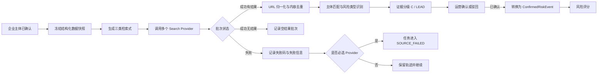

# W5 公开检索与证据链详细设计

## 1. 目标与范围

W5 服务于 Atlas V1 的唯一业务范围：更新单个企业的旧风险报告。本阶段只补齐“结构化数据快照之后、风险评分之前”的公开信息调查闭环，不扩展招商线索、多企业批处理、审核流或自主决策。

本阶段交付目标：

1. 根据企业唯一主体生成失联、欠薪、闭店三类检索式。
2. 同时支持传统搜索引擎、大模型搜索和测试夹具三类 Provider。
3. 区分“成功有结果”“成功无结果”“查询失败”。
4. 将候选结果归一化、去重、进行主体匹配和证据分级。
5. 由运营人员确认或驳回证据，并保留完整操作记录。
6. 只有已确认且可追溯的证据才能转为风险事件并参与评分。
7. 必选 Provider 失败时任务停止，但失败批次必须持久化，供排查和重试。

## 2. 明确边界

- 测试夹具只验证契约和流程，不代表真实互联网检索结果。
- 大模型输出若没有可访问的原文引用，只能作为 `LEAD` 线索，不能直接确认为风险证据。
- 自动主体匹配当前采用企业全称或统一社会信用代码强锚定；不能强锚定的结果标为可能匹配。
- V1 不进行情感分数、传播热度、媒体权重或自动风险结论计算。
- V1 不抓取受登录、验证码、robots、付费墙或访问条款限制的页面。
- 真实搜索服务的供应商选择、账号、配额、费用、合规条款和限流参数不在离线开发环境内验收。

## 3. 端到端流程



## 4. 模块职责

| 模块 | 职责 |
|---|---|
| `atlas-domain` | 检索批次、证据、证据决定、分级和状态等领域模型 |
| `atlas-application` | 检索计划、Provider 编排、归一化、去重、主体匹配、确认门禁 |
| `atlas-adapter-search` | 测试夹具、未配置 Provider，以及后续真实搜索适配器 |
| `atlas-adapter-storage` | 检索批次、证据和证据决定的 JDBC 持久化 |
| `atlas-api` | 检索、查询、确认、已确认事件和证据评分接口 |
| `atlas-worker` | 将公开检索步骤接入固定任务状态机 |

## 5. Provider 契约

`PublicSearchProvider` 对外暴露：

- `capabilities()`：Provider 名称、模式、是否返回可访问引用、是否为必选源。
- `search(SearchRequest)`：输入任务、企业主体、目标风险、检索式和请求时间，返回 `SearchBatch`。

Provider 模式：

| 模式 | 语义 |
|---|---|
| `SEARCH_ENGINE` | 传统搜索引擎或新闻搜索 API |
| `LLM_SEARCH` | 带联网检索能力的大模型 |
| `FIXTURE` | 自动化测试专用离线夹具 |

批次状态：

| 状态 | 语义 | 是否等于“没有风险” |
|---|---|---|
| `SUCCESS_WITH_RESULTS` | 查询成功且返回候选结果 | 否 |
| `SUCCESS_EMPTY` | 查询成功但未返回公开候选 | 否 |
| `FAILED` | 查询没有完成 | 否 |

Provider 抛出的运行时异常统一转换为 `FAILED / PROVIDER_EXCEPTION`，避免异常穿透后丢失审计信息。必选 Provider 任一检索批次失败，当前任务进入 `SOURCE_FAILED`。

## 6. 检索计划

针对已确认企业全称生成三类固定检索式：

| 风险类型 | V1 关键词 |
|---|---|
| `OUT_OF_CONTACT` | 失联、联系不上 |
| `WAGE_ARREARS` | 拖欠工资、欠薪、讨薪 |
| `STORE_CLOSURE` | 闭店、关店、停业 |

检索计划是确定性的，方便复现、比较 Provider 效果和重跑。后续可以增加品牌名、历史名称、门店名等扩展词，但必须保留企业主体锚点。

## 7. 证据归一化与去重

### 7.1 URL 归一化

- scheme 和 host 转为小写；
- 移除默认端口；
-移除 fragment；
-移除 `spm/from/source/ref/referrer/track/tracking` 等跟踪参数；
-剩余查询参数按键值排序；
-无法解析为 HTTP(S) 地址时，规范 URL 为空。

### 7.2 内容指纹

对标题和摘要进行空白规范化后计算 SHA-256。去重键优先使用规范 URL；没有 URL 时使用内容指纹。

### 7.3 主体匹配

| 状态 | 判定 |
|---|---|
| `MATCHED` | 标题或摘要包含企业完整登记名，或包含统一社会信用代码 |
| `POSSIBLE_MATCH` | 未命中强锚点，需要人工核对 |
| `MISMATCHED` | 保留给后续明确排除规则 |

## 8. 证据分级与确认门禁

| 等级 | 形成条件 | 能否直接确认 |
|---|---|---|
| `C` | 有可访问原文引用，且主体强匹配 | 可以，由运营确认 |
| `LEAD` | 无可访问引用，或主体只能可能匹配 | 不可以，需补充原文证据 |

证据初始状态均为 `UNVERIFIED`。运营只能提交：

- `CONFIRMED`：确认是目标企业且风险事实成立；
- `REJECTED`：主体不一致、内容不成立、重复、过期或其他原因。

每次决定必须包含操作人和原因。`LEAD` 提交 `CONFIRMED` 时返回业务校验错误，防止大模型摘要或无链接线索直接进入评分。

## 9. 评分衔接

`confirmedRiskEvents(taskId)` 只读取 `CONFIRMED` 证据，并转换为现有 `ConfirmedRiskEvent`：

- 失联最低 6 分；
- 欠薪最低 6 分；
- 闭店最低 8 分；
- 多个事件仍由现有评分引擎取最高事件最低分；
- 原始分和人工分继续分开保存。

接口 `POST /api/tasks/{taskId}/risk-score/calculate-from-confirmed-evidence` 不接受客户端自行拼装的证据文本，而是从服务端已确认记录生成评分输入。

## 10. 状态机

结构化数据收集完成后，任务进入：

```text
SEARCHING_PUBLIC_INTELLIGENCE
  -> 成功：CALCULATING_RISK
  -> 必选 Provider 失败：SOURCE_FAILED
```

对应步骤为 `SEARCH_PUBLIC_INTELLIGENCE`。失败任务保留 `failed_step` 和 `SEARCH_PROVIDER_UNAVAILABLE`，并可沿现有重试接口从失败步骤续跑。

## 11. 数据设计

Flyway V5 新增：

### `public_search_batch`

保存每个 Provider、每条检索式的执行情况，包括：

- task、snapshot、provider、provider mode；
- query、target risk；
- status、result count；
- failure code、failure message；
- searched time。

### `evidence` 扩展

保存来源 URL、规范 URL、域名、标题、摘要、检索式、排名、发布时间、抓取时间、内容指纹、主体匹配状态、验证状态、证据等级和元数据。

### `evidence_decision`

保存证据确认或驳回决定、原因、操作人和决定时间。

失败批次与成功证据处于同一检索事务中，但 `RequiredSearchProviderFailedException` 被配置为不回滚，保证任务停止时仍能看到失败轨迹。

## 12. API

| 方法 | 路径 | 用途 |
|---|---|---|
| POST | `/api/tasks/{taskId}/public-intelligence/search` | 执行或幂等读取公开检索 |
| GET | `/api/tasks/{taskId}/public-intelligence/searches` | 查询检索批次和失败轨迹 |
| GET | `/api/tasks/{taskId}/public-intelligence/evidence` | 查询候选证据 |
| POST | `/api/tasks/{taskId}/public-intelligence/evidence/{evidenceId}/decision` | 确认或驳回证据 |
| GET | `/api/tasks/{taskId}/public-intelligence/decisions` | 查询证据操作历史 |
| GET | `/api/tasks/{taskId}/public-intelligence/confirmed-events` | 查询可参与评分的事件 |
| POST | `/api/tasks/{taskId}/risk-score/calculate-from-confirmed-evidence` | 基于已确认事件评分 |

## 13. 验收策略

离线自动化验收覆盖：

1. 三类检索式生成。
2. 成功、空结果和失败状态区分。
3. 重复 URL 去重。
4. 无引用的大模型结果降级为 `LEAD`。
5. `LEAD` 无法直接确认。
6. 已确认闭店事件触发 8 分最低分。
7. 同任务重复搜索不重复写入证据。
8. 必选 Provider 失败后任务进入 `SOURCE_FAILED`。
9. 失败事务不回滚，三个失败检索批次均可查询。

真实搜索验收需另外准备：

- 至少一个主流搜索引擎 Provider；
- 至少一个支持引用返回的大模型搜索 Provider；
- 测试账号、API Key、配额和费用上限；
- 10 家已知有/无相关公开信息的企业验收清单；
- 结果可访问率、主体误匹配率、重复率、空结果率和失败率基线。

## 14. 后续扩展点

- Provider 限流、退避重试和熔断；
- 时间窗口与地域约束；
- 品牌、门店、历史名称和关联主体检索；
- 页面正文抓取与内容快照；
- 多条独立证据交叉验证；
- 证据时效性和官方来源分级；
- 模型辅助摘要，但不得越过证据确认门禁。
